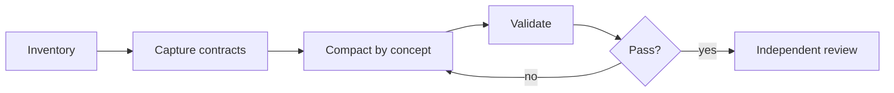

# Compaction

Compact policy; preserve meaning. Default: `.pi/{agents,skills}/**/*.md`;
arguments may narrow.



## Rule

```text
long prose -> short rules -> arrow map -> command table
```

- Group/deduplicate concepts; use terse fragments.
- Tables: commands/ownership/states. Mermaid: branches.
- Keep needed examples.
- Preserve: front matter; prohibitions; exceptions; approvals; safety; ownership; evidence; freshness; acceptance; revert/escalation; tools; budgets; selectors; paths; commands; flags; schemas; outputs; test literals; links/anchors/URLs; formulas; addresses; `SKILL.md`/reference boundaries.

## Run

1. Baseline: `.pi/skills/agent-skill-compaction/scripts/audit.py --output /tmp/agent-skill-before.json`.
2. Read related files. Compact agents, then each skill tree.
3. Compare with `HEAD` or baseline.
4. Check: `.pi/skills/agent-skill-compaction/scripts/audit.py --baseline /tmp/agent-skill-before.json --check`.
5. Run contexts, focused tests, and `test-skill-scripts.py`.
6. Run `git diff --check`; require empty staged diff.
7. Get semantic review.

Missing command -> report; run nearest structural check. Never skip silently.

## Bounds

Markdown policy only. No semantic changes; code, target metadata, lifts,
generated state, stage, commit, or push. Preserve unrelated dirt. Failed
contract -> repair/revert scoped rewrite; never waive.

Report files, size delta, checks, review, skips, risks. See [checklist](references/CONTRACTS.md).
