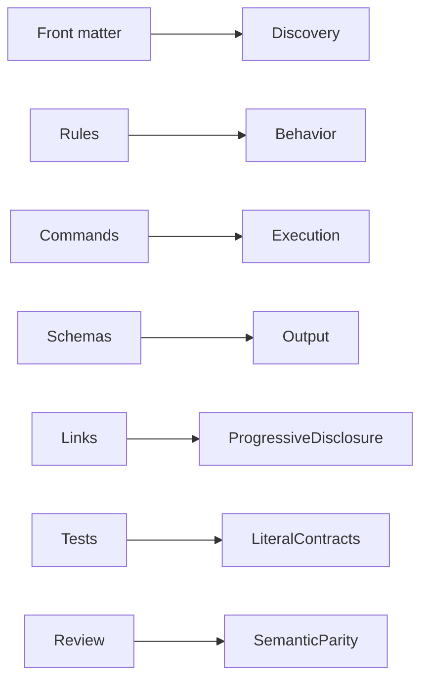

# Contract Checklist

Use while comparing old and compacted text.

| Contract | Preserve |
|---|---|
| Discovery | skill name, description, trigger language |
| Runtime | tools, model, thinking, context, time/turn/tool budgets |
| Scope | allowed paths, target/selector rules, ownership boundaries |
| Safety | bans, approvals, stop/revert rules, destructive-operation limits |
| Evidence | confidence, corroboration, freshness, validation requirements |
| Execution | ordered steps, commands, flags, dependencies, fallback paths |
| Output | schemas, required fields, fenced reports, artifacts |
| Knowledge | provenance, citations, durable-vs-disposable boundaries |
| Navigation | local links, anchors, URLs, relative paths |
| Tests | exact literals and phrases asserted by repository tests |

## Relational map

## Review questions

- Can the same task still trigger the skill or agent?
- Can it use the same tools and selectors?
- Are all refusal, approval, revert, and escalation paths intact?
- Are exactness and evidence thresholds unchanged?
- Does each command retain arguments and ordering?
- Are generated and reviewed truth still separated?
- Did a table or diagram accidentally weaken sequence or conditions?
- Did shortening merge distinct exceptions?
- Do all links and front matters parse?
- Do focused tests and independent review pass?
