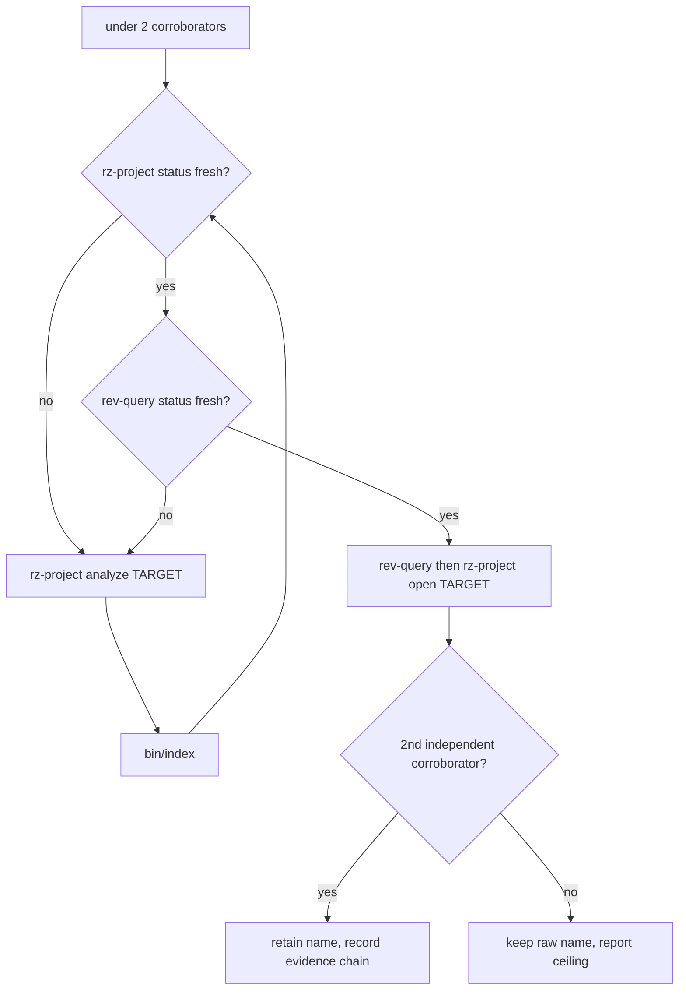

# Cleanup rules — where cleanup applies and where it never does

Never turn an audit into edits, a docs repair into a source refactor, or a naming transaction into a lift/matching experiment. Cosmetic and evidence-preserving only: source filename changes require a complete metadata-backed naming transaction; never change behavior or a byte-match.

## Evidence gate

Retain a name only with exact target-local address/layout plus two independent corroborators: two consistent local access/call sites; one local site plus a reviewed Rizin annotation; or proven local layout/dispatch table plus consistent uses. Decompiler name, duplicate hash, string, comment, or one call site alone: insufficient. Name only what evidence proves; keep `D_XXXXXXXX`/`unk_XX`/`field_XX` when meaning is uncertain. Name a proven data region by content class: strings, pointer/handler table, or struct layout plus consistent consumers; a `data-scan` ref count is a lead, not evidence.

Fewer than two corroborators in repo references? Not an evidence ceiling — run the focused PSX Rizin rung:

Procedure:

1. Check `bin/rz-project status TARGET --json` and `bin/rev-query --json status`.
2. Snapshot or reverse index stale/unavailable: automatically run `bin/rz-project analyze TARGET`, then `bin/index`; re-run both status commands and require both to pass before continuing.
3. These commands may refresh only disposable `out/reverse/` and `out/index/` state. Report a blocker only if regeneration or either post-refresh status check fails, naming the failed command and smallest repair.
4. Once fresh: query `bin/rev-query` calls/xrefs/symbols first, then inspect only the candidate, callers, xrefs, relevant data/table accesses with `bin/rz-project open TARGET`.
5. Empty or incomplete indexed xrefs are not an evidence ceiling. Use the PSX Rizin playbook's bounded direct-analysis fallback on the proven target image: inspect candidate instructions and delay slots, scan exact `jal` encodings and aligned pointer-table entries, decode only neighboring handlers/state accesses, and compare original bytes across the relevant table extent. This may elevate a mechanical behavior into a semantic role when it yields an independent machine-code caller, dispatch-slot/layout fact, or consistent state-machine consumer — these count as independent corroborators when their address model and boundaries are proven. Record target, runtime address, payload offset, commands, delay slots, evidence chain; never infer semantics from an analyzer label or address coincidence. Analyzer/decompiler output remains a hypothesis; do not add analyzer annotations or mutate reviewed tracked truth during cleanup audit mode.
6. Before returning `no-change`, follow each mechanical lead one semantic level further:
   - dispatcher/table slot: find the table consumer, owning state selector, and neighboring slot roles;
   - direct callers: inspect caller guards, state transitions, result use, and stable argument provenance;
   - transform/copy helper: compare independently understood callers and identify the source/destination runtime roles;
   - presentation helper: resolve the immediate callee and caller context sufficiently to distinguish drawing, positioning, and animation; a runtime-visible observation may corroborate the result but is optional;
   - raw data/global: find another consumer or initializer/use pair that establishes content class and runtime role.
   Repeated call sites with the same unexplained pattern are one mechanical lead, not multiple semantic corroborators. Automatically perform this bounded escalation with focused PSX Rizin/original-byte analysis; return `no-change` only after reporting the exact unresolved static evidence such as a callee role, table owner, state field, or argument meaning. Runtime traces and visible observations are optional corroborators: their absence, unavailability, or ambiguity must never block a naming transaction or force `no-change` when original-byte, layout, caller, and consumer evidence otherwise passes the gate.
7. When the semantic gate passes for a retained partial lift, automatically perform a spelling-only rung-4 transaction. Preserve the body, ABI, address, reviewed boundary, compiler settings, and all `@status partial`, `@match`, and `@residual` metadata. Partial code-generation exactness is not a naming blocker; it only prohibits bundling body or matching changes into the transaction.

A rename must not change width, signedness, pointer depth, volatility, ABI, storage, array extent, packing, code shape, control flow, matching aids, compiler flags, or binding addresses.

## Authority ceiling

- `symbol`/`type`: edit one selected target only — `symbols.txt` (one spelling, unchanged address), target `internal.h`/`symbols.c`, direct same-target references. Map sorted; no aliases; never edit generated `symbols/psyq.c`.
- Shared fixed-RAM exception: when a raw data symbol is already mapped by `config/targets/shared/symbols.txt`, or bounded recursive discovery proves the same address, content class, and runtime role across every consuming executable/overlay that composes that map, do not skip it merely because many targets use it. Promote one semantic spelling in the shared map and update every consuming target's declarations, bindings, reviewed annotations, and references atomically. Keep it target-local if any composing target uses that address for different data or lacks evidence; same address or high reference count alone is insufficient. A shared spelling globalizes only the data contract, not function/source ownership.
- `docs`: edit only named existing files under `docs/`, `AGENTS.md`, `README.md`. Delete dated lift counts, transient rankings, `out/` snapshots, dead links, duplicated instructions — never relocate them. Changelog/history entries stay. Durable facts → `docs/specs/`; agent policy → `docs/agents/`; scoped work → `docs/plans/`.
- `audit`: report each finding as `path`, current contract, evidence, smallest safe repair, validation, human-approval needed. A target-tree scope is recursive: discover targets from every descendant `config/targets/**/target.toml`, regardless of depth, and inspect each manifest's owned map, Splat file, sources, support sources, headers, and reviewed annotations. Header-tree scopes are also recursive: include every descendant `*.h` at arbitrary depth under named or manifest-owned header roots, then follow relevant repository-local `#include` edges for declaration/reference completeness without changing ownership. Never enumerate only immediate children or assume target/header path component counts. Audit manifest-less `config/targets/shared/` separately. Large `internal.h` and raw compiled-symbol spellings are not drift; source filenames may be semantic because metadata owns identity.
- `relocate`/`relocate-batch`: move lifts to `src/bof3/<class>/`, manifest claims + Splat `@source`; failure reverts all.

## Identity contracts — never touch

- Every lift carries parsable function-level `@behavior` and `@source`; the `@source` tag is the address authority and no filename fallback exists. Rename a source file or compiled entry function only through a complete naming transaction (evidence gate). Never rename a Splat function boundary address.
- Never drop `@behavior`/`@source`/`@kind` tags or evidence comments; correct stale tags in place. Tags written `/* @source 0x... @kind ... */` — `//` comments break gcc-2.6.3 variant objects.
- Never move target config directories or alter `source_dir`, load addresses, reviewed boundaries, SDK maps, public headers, `src/shared/`, `out/`, `build/`, `toolchains/`. Authorized relocation atomically updates source, support, header, `psyq_source`, C-boundary `@source`, required flag keys.
- Other reorganization needs a plan + explicit approval; otherwise report a blocker without edits.

## Transaction

1. Refuse overlap with an already-modified candidate file unless the parent names that exact edit as part of this transaction.
2. Naming: record old spelling, unchanged address/layout, binding location, target-local references, corroborating evidence; update map, declaration, binding, same-target references together. An evidence-backed retained partial lift is eligible for this spelling-only transaction; preserve its body and partial-status metadata verbatim and validate/report its live non-exact baseline rather than requiring byte equality. For data, also record content class as a `@kind: bss|rodata|string|table` comment beside the declaration. The map plus `WEAK_SYMBOL_AT` binding are the only address authorities, so a later rename or relocate stays one transaction. For the shared fixed-RAM exception, inventory every Splat file composing the shared map and every repository declaration/binding/reference; update all consumers in one transaction, remove compatibility/self-alias macros, and validate representative live exact consumers from each distinct target family that has an authored lift.
3. Docs: find the owning current fact; remove/correct only the stale claim.
4. Audit: classify — safe local repair, needs scoped plan, or blocked by ownership/evidence. For a target subtree, record the recursively discovered manifest count/identities; for a header subtree, record the recursively discovered header count/paths. These inventories make omitted deep targets or headers detectable. No manufactured abstractions.
5. Verify: no target-owned reference keeps the old spelling, no unrelated target changed, every edited doc link resolves.
6. After retaining any target symbol/map, reviewed Splat/annotation, or manifest source/support/header transaction and completing its normal symbol/Splat/build/byte checks, run `bin/rz-project status TARGET --json`. If stale, run `bin/rz-project analyze TARGET`; only after the target is fresh, run `bin/index` once for the completed transaction batch. Finally require both `bin/rz-project status TARGET --json` and `bin/rev-query --json status` to pass. Never index before refreshing every affected target snapshot, and never rebuild the global index once per edited file.
