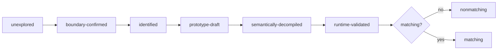

# Matching decompilation and build/diff workflow

## Milestones



Runtime-validated ≠ matching. Matching bytes do not independently prove names/types.

## PS1 decompilation stack

| Tool | Role |
|---|---|
| splat | split PSX binaries/sections/code/data; emit project config |
| spimdisasm | MIPS disassembly + symbol-aware analysis |
| maspsx | emulate PsyQ assembler behavior for matching builds |
| mips2c / m2c | initial C hypothesis |
| asm-differ | instruction-level comparison during iteration |
| objdiff | object/function comparison + progress tracking |
| decomp-permuter | explore equivalent C transformations |
| decomp.me | isolated scratch/matching experiments |

Real PS1 projects combine several; never rely on one decompiler.

## Compiler identification

Before tuning C, pin: PsyQ/runtime library version · GCC/CC1 version + flags · assembler/preprocessor behavior · optimization level · small-data/GP options · signed-char + ABI details · source language extensions · linker ordering/alignment. Evidence: library signatures, startup code, generated idioms, object metadata, debug strings, project/toolchain history, controlled compilation experiments.

## Repository structure

| Path | Role |
|---|---|
| `config/targets/` | per-target identity, layout, symbols, image, load address |
| `include/memory/` | generic PS1 memory/accessor headers |
| `include/bof3/` | shared + target-private declarations |
| `src/bof3/<domain>/` | metadata-owned executable + EMI lifts |
| `src/bof3/support/` | target-qualified support + generated bindings |
| `src/shared/<domain>/` | cross-target embedded templates |
| `build/` | generated objects/binaries |
| `out/` | disposable snapshots, index, matching workspaces |

See `docs/agents/project-context.md` + `docs/usage.md` for the canonical map.

## Function iteration

1. Extract exact original bytes/instructions.
2. Confirm boundaries + relocations.
3. Draft semantic C.
4. Compile with pinned toolchain.
5. Compare instructions + relocations.
6. Diagnose control flow, expression ordering, register allocation, stack layout, delay slots.
7. Apply one intentional change at a time.
8. Preserve readability unless a matching idiom is proven necessary.
9. Record score + first differing instruction.
10. Runtime regression when integration is possible.

## Common mismatch causes

Signature/signedness · source expression order · temporary lifetime · switch lowering form · loop shape (`for`/`while`/`do`) · constant type/width · struct field type/alignment · inlining/macros · compiler version/flags · assembler macro expansion · section/order/relocation mismatch · data symbol alignment.

## Build comparison

> `bin/build-diff` is NOT wired in this repo. Use the wired entrypoints:

```bash
bin/asm-diff TARGET@0xADDRESS        # instruction-level diff of one authored lift
bin/byte-match TARGET@0xADDRESS      # raw byte-equality acceptance check
bin/permute TARGET@0xADDRESS --time-limit 300   # bounded source-shape search
bin/decomp-status TARGET             # exact/partial/invalid lift audit
```

Generic projects outside this repo: a `build-diff`-style wrapper reads environment variables rather than imposing a build system:

```bash
PSX_BUILD_CMD='ninja -C build' \
PSX_EXPECTED=expected/SLUS.bin \
PSX_ACTUAL=build/SLUS.bin \
build-diff
```

Such wrappers record SHA-256 + byte differences; prefer `bin/asm-diff`/`bin/byte-match` when they already cover the comparison.

## Reproducibility

Pin tool versions in lockfiles/containers where possible. Retain: compiler/assembler hashes, command lines, environment variables, generated linker scripts/maps, original + rebuilt object hashes, diff reports. Do not publish copyrighted original binaries or large binary slices merely to make CI convenient.
