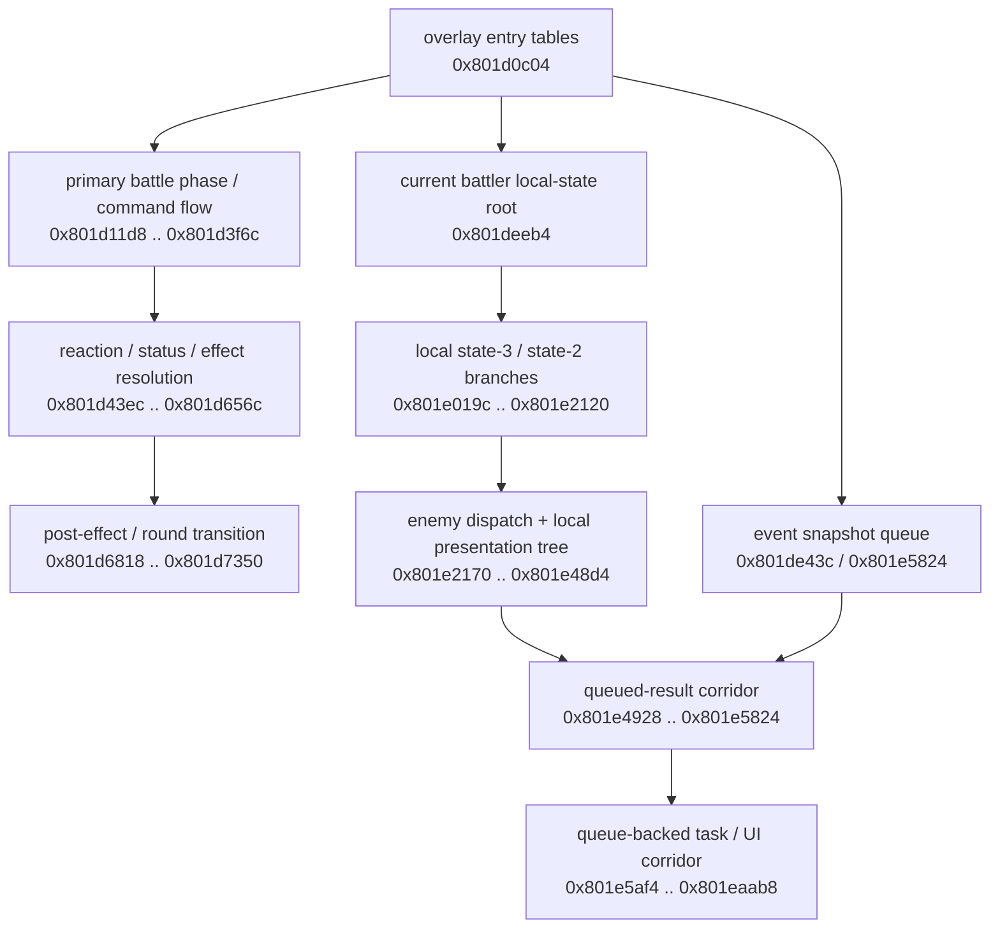
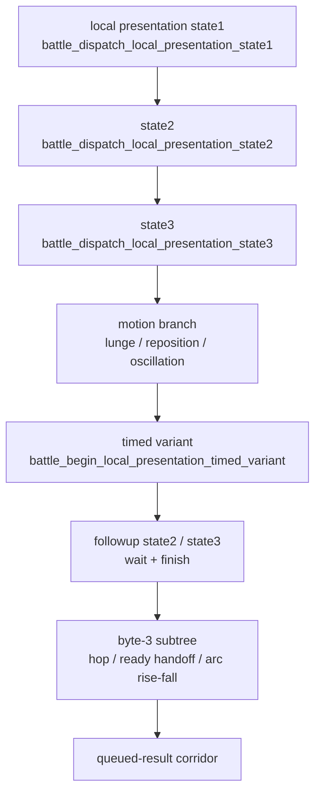
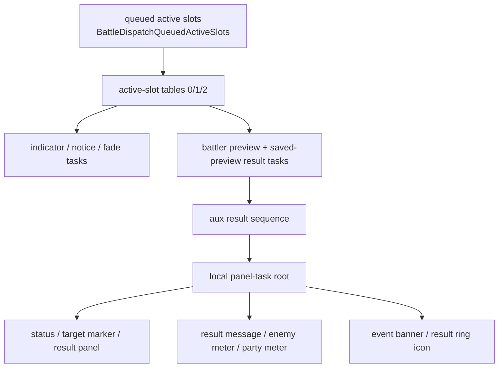

# Representative Battle Overlay: `/bins/BIN/BATTLE/BATTLE/3.bin`

This document is the canonical runtime reference for the representative battle
overlay `/bins/BIN/BATTLE/BATTLE/3.bin`.

It summarizes the stable subsystem structure currently defended from overlay-local
dispatch tables, callers, and metadata for the exact-duplicate battle family
loaded at `0x801d0c00`.

## Orientation

### Representative facts

| Field | Value |
| --- | --- |
| Program path | `/bins/BIN/BATTLE/BATTLE/3.bin` |
| Source archive | `BIN/BATTLE/BATTLE` entry `3` |
| Load address | `0x801d0c00` |
| Representative name | `ovl_battle_battle_e03_801d0c00` |
| Duplicate scope | exact-duplicate group size `42` across `BATTLE` / `BOSS` |
| Canonical inventory store | `processed/inventory/` |
| Inventory evidence source | `processed/inventory/` views and metadata rows |
| Current undefined-row state | `row_count: 0` |
| Frontier status | semantically closed under the current canonical bundle |

Why this family matters:

- it is the representative recovery target for a large exact-duplicate battle
  overlay group
- it contains one battle-local control region spanning command flow,
  reaction/status resolution, event queueing, battler-local presentation,
  queued result handling, and queue-backed battle UI tasks
- the current canonical shard is clean: earlier out-of-range module-assignment leakage
  was removed, so the remaining interpretation is local to this overlay family

### Family context

| Representative | Load address | Current role in repo docs |
| --- | --- | --- |
| `ovl_battle_battle_e15_80096800` | `0x80096800` | earlier representative battle control recovery |
| `ovl_battle_battle_e03_801d0c00` | `0x801d0c00` | primary representative for the larger local-state / queued-result / UI corridor documented here |

## Evidence and confidence

- implementation claims here are based on overlay-local control flow and current
  canonical metadata for `/bins/BIN/BATTLE/BATTLE/3.bin`
- exact gameplay meaning is still tentative where only implementation evidence is
  available
- representative findings apply to the exact-duplicate family as a shared
  implementation, not as separately proven bespoke logic for every duplicate

@source: `processed/inventory/`

## High-level control map

The important structural point is that the `0x801d0c00` family is not just one
action dispatcher. It combines:

- battle-global phase/validation/status work in the early `0x801dxxxx` region
- battler-local state and presentation routing in the `0x801dexxx .. 0x801e48xx`
  region
- a queue-backed result/UI/task corridor in the `0x801e4928 .. 0x801eaab8`
  region

## Key dispatch anchors and selector bytes

| Selector / table | Dispatcher | Stable interpretation |
| --- | --- | --- |
| `0x801d0c04` | overlay root pointer block | early top-level battle phase entrypoints including command / init / cleanup branches |
| `0x801d0c2c` | `switchD_801d5054` | proven 14-entry jump table keyed by `DAT_801462e2`; battle-phase dispatcher with repeated fallthrough slots |
| `0x801d0ca0` | local presentation-variant switch via `battle_dispatch_current_battler_presentation_variant` | proven 6-entry local presentation-variant switch |
| `0x801eb120` | current battler local-state root via `battle_dispatch_current_battler_local_state` | current battler local-state root |
| `0x801eb1e0` | `battle_dispatch_local_substate3_followup` | early local substate-3 followup branch |
| `0x801eb210` | `battle_dispatch_local_presentation_state4` | local completion / presentation-state-4 branch |
| `0x801eb218` | `battle_dispatch_local_alt_state3` | alternate local state-3 pending-amount branch |
| `0x801eb224` | `battle_dispatch_local_state2_class_branch` | class-specific local state-2 branch |
| `0x801eb26c` | `battle_dispatch_local_state2_event_branch` | state-2 event-snapshot branch |
| `0x801eb274` | `battle_dispatch_local_state2_followup_table` | state-2 followup-table branch |
| `0x801eb27c` | `battle_dispatch_default_class_branch` | default battler-class fallback branch |
| `0x801eb3b0` .. `0x801eb424` | `0x801e31c8`, `0x801e32ac`, `0x801e32f0`, `0x801e3438`, `0x801e3a00`, `0x801e3b68`, `0x801e3bd0` | later local presentation byte-2 tree: lunge, reposition, oscillation, timed variant, and followup routing |
| `0x801eb430` | `BattleDispatchLocalPresentationByte3` | byte-3 hop / wait / handoff branch |
| `0x801eb444` | `BattleDispatchLocalPresentationArcStep` | byte-3 arc rise / fall branch |
| `0x801eb454`, `0x801eb460`, `0x801eb46c`, `0x801eb478` | `BattleDispatchQueuedResultSubstate`, `BattleDispatchQueuedResultNoticeSubstate`, `BattleDispatchQueuedResultCleanupSubstate`, `BattleDispatchQueuedResultArcSubstate` | queued-result amount / notice / cleanup / arc sub-dispatch corridor |
| `0x801d0cc0` | `BattleDispatchQueuedActiveSlots` | queued active-slot routing for `DAT_801ec330` records |
| `0x801d0cd0`, `0x801d0d1c`, `0x801d0ed4` | `battle_dispatch_active_slot_table_0`, `_1`, `_2` | queue-backed active-slot task tables feeding indicator / notice / preview / result work |
| `_DAT_80148648 + 2` | `battle_dispatch_local_panel_task_root` | local panel-task root for status, markers, result panels, meters, event banners, and ring icons |

@source: 0x801d0c2c switchD_801d5054; 0x801d0ca0 battle_dispatch_current_battler_presentation_variant (local presentation-variant switch); 0x801deeb4 battle_dispatch_current_battler_local_state (current battler local-state root); 0x801e046c battle_dispatch_local_substate3_followup; 0x801e1670 battle_dispatch_local_state2_class_branch; 0x801e31c8 battle_dispatch_local_presentation_state1; 0x801e4490 BattleDispatchLocalPresentationByte3; 0x801e4928 BattleDispatchQueuedResultSubstate; 0x801e5824 BattleDispatchQueuedActiveSlots; 0x801e9074 battle_dispatch_local_panel_task_root

## Major helper families

| Family | Key entrypoints | Stable role |
| --- | --- | --- |
| Global battle backbone | `0x801d11d8`, `0x801d24d4`, `0x801d2b58`, `0x801d43ec`, `0x801d6818` | command flow, cleanup, queued action context, reaction/status resolution, and round transition |
| Local battler state spine | `0x801dece0`, `0x801ded54`, `0x801deeb4`, `0x801def0c`, `0x801df8ac`, `0x801e046c`, `0x801e1450`, `0x801e1670` | party-side entry, current-battler local-state routing, local-state-2 setup, and class/event dispatch before later presentation/result work |
| Enemy selection + animation | `0x801e2170`, `0x801e25e0`, `0x801e2a88`, `0x801e30f8` | enemy-side handler dispatch, target choice, animation dispatch, and readiness gates |
| Local presentation tree | `0x801e31c8`, `0x801e3438`, `0x801e3a00`, `0x801e4490`, `0x801e4760` | battler-local motion, followup, hop, and arc subtrees |
| Queued-result corridor | `0x801e4928`, `0x801e4ae8`, `0x801e4d8c`, `0x801e4f64`, `0x801e5824` | queued amount application, notice timing, cleanup, arc/fade impact handling, and active-slot dispatch |
| Queue-backed UI/task corridor | `0x801e5af4`, `0x801e6c84`, `0x801e7818`, `0x801e9074`, `0x801ea650`, `0x801ea7dc` | indicator, notice, preview/result tasks, panel tasks, event banners, and result-ring icons |

## Global battle backbone

The early `0x801dxxxx` region is the overlay's battle-global control layer. It
is less about battler-local presentation and more about deciding what the battle
engine should do next.

| Cluster | Key entrypoints | Stable role |
| --- | --- | --- |
| Primary command / target phase | `0x801d11d8`, `0x801d1228`, `0x801d1828`, `0x801d1ae8`, `0x801d1b94`, `0x801d1c90`, `0x801d1d10`, `0x801d1e8c` | primary overlay-local phase dispatcher, target-selection input, and init/reset gates |
| Secondary cleanup branch | `0x801d24d4`, `0x801d25a0`, `0x801d277c`, `0x801d2a24` | teardown, effect cleanup, and wait-for-completion helpers |
| Scripted action context and validation | `0x801d2b58`, `0x801d3050`, `0x801d31fc`, `0x801d3304`, `0x801d3624` | queued action loading, validation, Escape path handling, and command remap / continuation |
| Prompt / message / status followup | `0x801d3844`, `0x801d39bc`, `0x801d3a64`, `0x801d3bb4`, `0x801d3c1c`, `0x801d3cc4`, `0x801d3e80`, `0x801d3f6c` | prompt emission, wait states, status refresh, and return to dispatcher state `3` |
| Reaction / counter / status resolution | `0x801d43ec`, `0x801d4850`, `0x801d4b38`, `0x801d4d44`, `0x801d527c`, `0x801d54f8`, `0x801d5658`, `0x801d57ac`, `0x801d590c`, `0x801d5a60`, `0x801d5bc0` | reaction swapping, counter cleanup, and several flag-specific status/effect resolution paths |
| Shared amount / completion helpers | `0x801d5dcc`, `0x801d62d8`, `0x801d64c4`, `0x801d656c` | display deltas, half-step application, battler-skip predicate, and slot-completion gate |
| Post-effect / round transition | `0x801d6818`, `0x801d6d90`, `0x801d6eac`, `0x801d7108`, `0x801d716c`, `0x801d71e0`, `0x801d7234`, `0x801d7350` | post-effect slot allocation, wait/advance steps, message queueing, selection snapshot capture, and phase teardown |
| UI primitive and selection math helpers | `0x801d750c`, `0x801d7a40`, `0x801d8090`, `0x801da14c`, `0x801da328`, `0x801da408`, `0x801da4b4`, `0x801da5a8`, `0x801da69c`, `0x801da7d4`, `0x801daae4`, `0x801db058`, `0x801db2f8`, `0x801db3a0`, `0x801db3e4`, `0x801db434`, `0x801db494`, `0x801db524`, `0x801db5cc`, `0x801db6f4`, `0x801db844`, `0x801db9e4`, `0x801dbb78`, `0x801dc044`, `0x801dc73c`, `0x801dc894`, `0x801dcad8`, `0x801dccb0`, `0x801dcd50`, `0x801dcef8`, `0x801dd08c`, `0x801dd14c`, `0x801dd29c`, `0x801dd350`, `0x801dd3cc`, `0x801dd448`, `0x801dd704`, `0x801dd8ac`, `0x801dd978`, `0x801ddab4`, `0x801ddcb4`, `0x801de190`, `0x801de1b0` | panel drawing, action order, eligibility, damage/effect math, battler snapshots, orientation helpers, and battler dirty-bit maintenance |

## Event queue and message staging

This overlay owns its own local event snapshot machinery before the later
queued-result and UI task corridor starts.

| Cluster | Key helpers | Stable role |
| --- | --- | --- |
| Snapshot / queue mutation | `0x801ddaf0`, `0x801ddb7c`, `0x801de1d4`, `0x801de560`, `0x801de60c`, `0x801de804`, `0x801de858` | build kind-`6` / kind-`7` event snapshots, enqueue or overwrite queue slots, reset the queue, and test for active kinds |
| Sequence / class counters | `0x801dd800`, `0x801dd858`, `0x801dde7c`, `0x801ddf28`, `0x801ddf50`, `0x801ddfec` | animation ping-pong, per-form sequence lookup, class counters, and mixed-order followup dispatch |
| Active-slot dispatch | `0x801de43c`, `0x801de698`, `0x801de754`, `0x801de8c0`, `0x801de92c` | two-phase active-slot routing, per-class countdown handlers, and a small overlay-local ring buffer |
| Message staging | `0x801de94c`, `0x801de9a8`, `0x801dea18`, `0x801dea64`, `0x801deae0`, `0x801debc4` | load strings/resources into scratch buffers and install them through the queue helpers |

Before the deeper local state machine starts, the party-side entrypoints in this
region already establish the battler-local control spine:

- `battle_dispatch_party_local_states`
- `battle_refresh_all_party_widgets`
- `battle_dispatch_current_battler_local_state`
- `battle_init_current_battler_local_state2`

Stable role: bind party battlers into the scratch context, refresh their basic
widgets, dispatch the current battler's local state, and seed the first local
state-2 presentation setup before the later state-2 / presentation trees.

@source: 0x801de43c battle_dispatch_active_event_slots (two-phase active event-slot dispatcher); 0x801de560 battle_enqueue_event_queue_record (enqueue free event record); 0x801de60c battle_overwrite_event_queue_slot (overwrite active event record); 0x801de804 battle_clear_event_queue_control_bytes (clear event queue control bytes); 0x801de8c0 battle_push_event_ring_record (small event/ring helper); 0x801de94c battle_stage_attack_name_message (message staging helper)

## Early local substate-3 and local-state-2 spine

This is the first large battler-local branch after the current-battler dispatch
root. It is best read as one nested local-state machine, not as isolated leaf
helpers.

@source: 0x801e019c battle_wait_local_substate3_ready; 0x801e046c battle_dispatch_local_substate3_followup; 0x801e1298 battle_dispatch_local_presentation_state4; 0x801e1450 battle_dispatch_local_alt_state3; 0x801e1670 battle_dispatch_local_state2_class_branch; 0x801e1b64 battle_dispatch_local_state2_event_branch; 0x801e1cd8 battle_dispatch_local_state2_followup_table; 0x801e1e7c battle_dispatch_default_class_branch

### Substate-3 launch and followup branch

- `battle_wait_local_substate3_ready`
- `battle_finish_local_substate3_followup`
- `battle_dispatch_local_substate3_followup`
- `battle_begin_local_substate3_launch`
- `battle_step_local_substate3_launch`
- `battle_finish_local_substate3_launch`
- `battle_advance_local_substate3`
- `battle_dispatch_local_substate3_late_branch`
- `battle_route_local_post_action_followup`

Stable role: waits for readiness, launches a local post-action sequence,
advances through timed followup steps, and routes late followup handling.

### Completion, countdown, and alternate local-state-3 handling

- `battle_refresh_all_battler_presentation`
- `battle_all_party_battlers_clear_local_blocks`
- `battle_resolve_local_countdown_event`
- `battle_finish_local_countdown_event`
- `battle_resolve_local_countdown_message`
- `battle_dispatch_local_presentation_state4`
- `battle_begin_local_completion_wait`
- `battle_finish_local_completion_wait`
- `battle_dispatch_local_alt_state3`
- `battle_apply_local_pending_amount`
- `battle_finish_local_alt_state3`

Stable role: refreshes presentation state across battlers, resolves countdown
events/messages, waits for local completion, and applies a pending local amount
before leaving the alternate state-3 path.

### Local state-2 class, event, and default-class branches

- `battle_dispatch_current_battler_class_handler`
- `battle_begin_current_battler_class_handler`
- `battle_dispatch_local_state2_class_branch`
- `battle_begin_local_state2_class_sequence`
- `battle_wait_local_state2_class_sequence`
- `battle_finish_local_state2_class_sequence`
- `battle_dispatch_local_state2_followup_branch`
- `battle_advance_local_state2_followup`
- `battle_finish_local_state2_followup`
- `battle_refresh_current_battler_presentation`
- `battle_cache_current_battler_ready_flag`
- `battle_maybe_reset_local_state2_on_global_flag4`
- `battle_dispatch_local_state2_event_branch`
- `battle_queue_local_position_event`
- `battle_refresh_local_state2_branch_flags`
- `battle_dispatch_local_state2_followup_table`
- `battle_begin_local_state2_followup_table`
- `battle_enter_local_state8`
- `battle_reset_local_state2_branch`
- `battle_dispatch_default_class_branch`
- `battle_queue_default_class_snapshot_event`
- `battle_wait_default_class_branch`
- `battle_maybe_reset_default_class_branch`

Stable role: class-specific and default-class state-2 routing, event snapshot
allocation, readiness caching, and reset/enter-state handoffs. The lightweight
helpers `battle_current_battler_ready_check_a` and
`battle_current_battler_ready_check_b` are the common inner readiness wrappers
used throughout this corridor, while `battle_current_battler_ready_gate_a` and
`battle_current_battler_ready_gate_b` remain the later stronger gated helpers in
the enemy/presentation path.

@source: 0x801df8ac battle_dispatch_current_battler_class_handler; 0x801df914 battle_begin_current_battler_class_handler; 0x801dede4 battle_current_battler_ready_check_a; 0x801dee4c battle_current_battler_ready_check_b

## Enemy battler dispatch and target selection

This cluster connects enemy traversal, target choice, and the readiness gates
that feed the later local presentation tree.

@source: 0x801e2170 battle_dispatch_enemy_class_handlers; 0x801e25e0 battle_choose_enemy_target_mode; 0x801e2a88 battle_resolve_enemy_target_code; 0x801e30f8 battle_current_battler_ready_gate_a; 0x801e3b04 battle_finish_local_presentation_timed_variant

### Enemy dispatch and animation helpers

- `battle_dispatch_enemy_class_handlers`
- `battle_refresh_all_enemy_widgets`
- `battle_play_current_battler_animation_variant`
- `battle_play_enemy_animation_variant_with_context`
- `battle_play_enemy_animation_variant`

Stable role: walk active enemies, run per-class handlers, and play the
appropriate animation variant either for the current battler or a rebound enemy
context.

### Target-mode and picker family

- `battle_choose_enemy_target_mode`
- `battle_pick_enemy_target_weighted_or_random_other`
- `battle_pick_random_other_enemy_target`
- `battle_resolve_enemy_target_code`
- `battle_pick_lowest_enemy_metric_target`
- `battle_pick_enemy_target_by_mode_flag`
- `battle_pick_lowest_party_metric_target`
- `battle_pick_weighted_target_from_formation`
- `battle_pick_offset_enemy_or_ff`

Stable role: select a target mode from battler state plus RNG, then resolve a
party or enemy target through weighted, random-other, lowest-metric, or
offset-based fallbacks.

### Ready gates and timed-variant close

- `battle_current_battler_ready_gate_a`
- `battle_current_battler_ready_gate_b`
- `battle_finish_local_presentation_timed_variant`

Stable role: gate progression until the current battler is ready, then commit a
selected target and hand off into the next presentation/followup step.

## Local presentation and motion subtree

This subtree is the clearest battler-local motion/presentation spine currently
recovered from the representative overlay.

@source: 0x801e31c8 battle_dispatch_local_presentation_state1; 0x801e3438 battle_dispatch_local_presentation_motion; 0x801e3a00 battle_dispatch_local_presentation_timed_variant_state2; 0x801e4490 BattleDispatchLocalPresentationByte3; 0x801e4760 BattleDispatchLocalPresentationArcStep

### Byte-2 presentation dispatch spine

- `battle_dispatch_local_presentation_state1`
- `battle_init_local_presentation_state1`
- `battle_dispatch_local_presentation_state2`
- `battle_dispatch_local_presentation_state3`
- `battle_begin_local_presentation_lunge`
- `battle_step_local_presentation_lunge`
- `battle_dispatch_local_presentation_motion`
- `battle_prepare_local_presentation_reposition`
- `battle_step_local_presentation_reposition`
- `battle_begin_local_presentation_variant_gate`
- `battle_dispatch_local_presentation_oscillation`
- `battle_update_local_presentation_rebound_triple`
- `battle_begin_local_presentation_timed_variant`
- `battle_dispatch_local_presentation_timed_variant_state2`
- `battle_wait_local_presentation_timed_variant`
- `battle_dispatch_local_presentation_followup_state2`
- `battle_dispatch_local_presentation_followup_state3`
- `battle_wait_local_presentation_followup_ready`
- `battle_finish_local_presentation_followup`
- `BattleShouldSetLocalFollowupFlag`

Stable role: initialize battler-local motion, run short lunge/reposition steps,
gate variant-specific behavior, and decide whether a followup leg should be set.

### Byte-3 hop / arc subtree

- `BattleDispatchLocalPresentationByte3`
- `BattleInitLocalPresentationHop`
- `BattleTickLocalPresentationHop`
- `BattleFinishLocalPresentationHop`
- `BattleWaitLocalPresentationReady`
- `BattleDispatchLocalPresentationArcStep`
- `BattleInitLocalPresentationArcRise`
- `BattleTickLocalPresentationArcRise`
- `BattleStartLocalPresentationArcFall`
- `BattleTickLocalPresentationArcFall`

Stable role: a second local presentation layer for short hop motion, ready
handoff, and a bounded arc rise/fall leg before the queued-result corridor
starts.

## Queued-result corridor (`0x801e4928 .. 0x801e5824`)

This corridor stays inside the same battle-local state machine. It is the bridge
between local presentation completion and later queue-backed UI/result tasks.

| Corridor phase | Key helpers | Stable role |
| --- | --- | --- |
| Amount | `BattleDispatchQueuedResultSubstate`, `BattleApplyQueuedResultAmount`, `BattleFinishQueuedResultAmount` | apply queued amount/state to the local battler and finish the amount leg |
| Notice | `BattleDispatchQueuedResultNoticeSubstate`, `BattleInitQueuedResultNotice`, `BattleTickQueuedResultNoticeDelay`, `BattleWaitQueuedResultNoticeReady` | stage and delay notice output until the battler/UI path is ready |
| Cleanup | `BattleDispatchQueuedResultCleanupSubstate`, `BattleAdvanceQueuedResultCleanup`, `BattleClearQueuedResultPendingState`, `BattleMaybeResetAfterQueuedResultFocus` | clear pending result state, reset focus if needed, and advance cleanup |
| Arc / impact | `BattleDispatchQueuedResultArcSubstate`, `BattleInitQueuedResultArc`, `BattleTickQueuedResultArcFade`, `BattleFinishQueuedResultArc`, `BattleAdvanceQueuedResultAnimGate`, `BattlePlayQueuedResultSoundIfPresent`, `BattleAccumulateQueuedResultIds`, `BattleFinalizeQueuedResultImpact` | visual fade/arc impact leg, optional sound emission, and queued-result id accumulation |
| Exit / followup | `BattleResetLocalPresentationAfterQueuedResult`, `BattleMaybeQueueFollowupEventFromFlag8`, `BattleWatchMessage0xbdFollowup`, `BattleDispatchQueuedActiveSlots` | restore local presentation state, optionally enqueue a followup event, watch message `0xbd`, and route queued active slots |

@source: 0x801e4928 BattleDispatchQueuedResultSubstate; 0x801e4ae8 BattleDispatchQueuedResultNoticeSubstate; 0x801e4d8c BattleDispatchQueuedResultCleanupSubstate; 0x801e4f64 BattleDispatchQueuedResultArcSubstate; 0x801e5824 BattleDispatchQueuedActiveSlots

## Queue-backed UI, preview, result, and panel tasks

### Queue utilities and active-slot roots

- `battle_alloc_event_slot`
- `battle_reset_local_task_slot`
- `battle_reset_event_snapshot_queue`
- `battle_noop`
- `battle_dispatch_active_slot_table_0`
- `battle_dispatch_active_slot_table_1`
- `battle_dispatch_active_slot_table_2`

Stable role: allocate local event-backed task slots, reset queue/task state, and
enter one of the three queue-backed active-slot task tables.

### Indicator, slide, notice, and simple fade tasks

- `battle_draw_local_indicator_step`
- `battle_init_local_indicator`
- `battle_wait_local_indicator_launch`
- `battle_begin_local_indicator_travel`
- `battle_step_local_indicator_travel`
- `battle_clear_actor_flag_0x80_after_delay`
- `battle_draw_indicator_digits`
- `battle_dispatch_view_offset_slide`
- `battle_step_view_offset_slide_neg`
- `battle_step_view_offset_slide_pos`
- `battle_dispatch_overlay_notice`
- `battle_init_overlay_notice`
- `battle_wait_overlay_notice`
- `battle_dispatch_grayscale_primitive_fade`
- `battle_step_grayscale_primitive_fade`
- `battle_draw_grayscale_primitive_fade`
- `battle_dispatch_notice_sequence`
- `battle_init_notice_sequence`
- `battle_wait_notice_sequence_ready`
- `battle_finish_notice_sequence`

Stable role: transient indicators, small signed screen-offset slides, overlay
notice tasks, grayscale primitive fades, and a small timed notice-sequence
state machine.

### Battler preview and saved-preview result sequence

- `battle_dispatch_battler_preview_sequence`
- `battle_wait_battler_preview_ready`
- `battle_init_battler_preview_sequence`
- `battle_reset_battler_preview_sequence`
- `battle_step_battler_preview_sequence`
- `battle_step_battler_preview_retreat`
- `battle_dispatch_battler_preview_restore`
- `battle_restore_battler_preview_snapshot`
- `battle_dispatch_battler_result_sequence`
- `battle_show_result_message_variant`
- `battle_commit_result_sequence_battler_state`
- `battle_finish_result_message_task`
- `battle_dispatch_saved_preview_result_task`
- `battle_arm_saved_preview_result_task`
- `battle_reveal_saved_preview_result`
- `battle_show_saved_preview_result_cue`
- `battle_have_pending_result_snapshot`
- `battle_begin_battler_result_sequence`
- `battle_finish_battler_result_sequence`

Stable role: preview a battler-local result state, restore saved snapshots,
reveal the saved-preview result, commit it back into live state, and finish the
result animation/message task.

### Auxiliary result sequence and panel-task root

- `battle_dispatch_result_ui_aux_sequence`
- `battle_begin_result_ui_aux_sequence`
- `battle_finish_result_ui_aux_sequence`
- `battle_compute_preview_anchor`
- `battle_select_next_preview_slot`
- `battle_dispatch_local_panel_task_root`

Stable role: a second result-sequence family adjacent to the main battler result
task, plus helper logic for preview anchors, preview slot selection, and entry
into the panel-task root.

### Local panel, message, and meter families

- `battle_dispatch_status_panel_task`
- `battle_step_status_panel_drop`
- `battle_draw_status_panel_hold`
- `battle_dispatch_target_marker_task`
- `battle_step_target_marker_decay`
- `battle_step_target_marker_focus`
- `battle_dispatch_result_panel_task`
- `battle_refresh_result_panel_target_preview`
- `battle_dispatch_result_message_panel`
- `battle_draw_result_message_panel`
- `battle_dispatch_enemy_meter_panel`
- `battle_prepare_enemy_meter_panel`
- `battle_draw_enemy_meter_panel_frame`
- `battle_draw_enemy_meter_panel_body`
- `battle_dispatch_party_meter_panel`
- `battle_prepare_party_meter_panel`
- `battle_mark_party_meter_target_match`
- `battle_draw_party_meter_panel_body`
- `battle_mark_panel_target_match`
- `battle_restore_panel_origin`
- `battle_dispatch_panel_meter_delta`
- `battle_prepare_panel_meter_delta`
- `battle_step_panel_meter_delta_down`
- `battle_step_panel_meter_delta_up`

Stable role: local status and target-marker panels, result panels/messages,
enemy and party meter panels, target-match highlighting, origin restore, and a
shared meter-delta animator.

### Event banner, ring icon, and tail helpers

- `battle_dispatch_event_banner_task`
- `battle_step_event_banner_enter`
- `battle_step_event_banner_exit`
- `battle_dispatch_result_ring_icon_task`
- `battle_step_result_ring_icon_enter`
- `battle_step_result_ring_icon_hold`
- `battle_step_result_ring_icon_exit`
- `battle_draw_result_ring_icon`
- `battle_advance_result_ring_consumer`
- `battle_measure_result_message_tokens`

Stable role: queue-backed wide event banners, queue-backed result-ring icon
animation, result-ring consumption, and token-width measurement for result
messages.

These event-banner helpers are also the last local functions that closed the
representative undefined-metadata shard under the current canonical bundle.

@source: 0x801e590c battle_alloc_event_slot; 0x801e5af4 battle_dispatch_active_slot_table_0; 0x801e6c84 battle_dispatch_battler_preview_sequence; 0x801e7818 battle_dispatch_saved_preview_result_task; 0x801e862c battle_dispatch_result_ui_aux_sequence; 0x801e9074 battle_dispatch_local_panel_task_root; 0x801ea650 battle_dispatch_event_banner_task; 0x801ea7dc battle_dispatch_result_ring_icon_task; 0x801eab6c battle_measure_result_message_tokens

## Practical interpretation for future RE and lifting

- treat `/bins/BIN/BATTLE/BATTLE/3.bin` as the representative implementation for
  the exact-duplicate `0x801d0c00` battle family
- keep the split explicit between:
  - global battle phase / validation / status logic
  - battler-local state and presentation dispatch
  - queued-result / queue-backed UI task handling
- keep overlay-local dispatch tables and selector bytes visible in future docs
  and source promotion work; many important branch points are data-driven
- do not flatten the local presentation tree or queued-result corridor into one
  monolithic "battle animation" helper: the current evidence supports multiple
  nested state machines
- use this representative to map duplicate `BATTLE` / `BOSS` archive entries back
  to one shared implementation before doing broader battle decomp promotion
