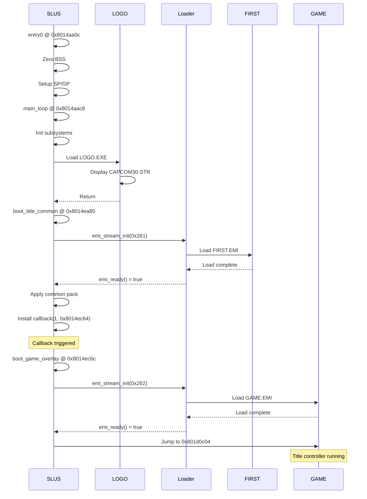

# Boot Sequence and State Transitions

This document provides a complete reverse-engineered map of the boot sequence from SLUS entry point through the title/intro sequence to the main game controller, including all state transitions and callbacks.

## Overview

The boot flow follows this high-level sequence:

```
SLUS Entry → LOGO.EXE → FIRST.EMI → GAME.EMI → Main Game Loop
```

## Entry Point Analysis

### 0x8014aa0c (entry0)

@source: 0x8014aa0c entry0

The PS-X EXE entry point performs minimal initialization before calling the main function.

**Observed behavior:**

```c
void _start(void) {
    // Zero BSS segment (0x80145cb8 to 0x80195660)
    memset(0x80145cb8, 0, 0x309a8);
    
    // Set up stack pointer from header
    sp = *((u32*)0x8014aab8) | 0x80000000;
    
    // Set up global pointer
    gp = 0x801952b4;
    
    // Call initialization
    fcn_8017eccc();
    
    // Enter main loop
    main_loop();
    
    // Should never reach here
    break 0, 1;
}
```

### 0x8014aac8 (main_loop)

@source: 0x8014aac8 fcn.8014aac8

The main game loop sets up the initial state machine and enters the primary callback scheduler.

**Initialization sequence:**

```c
void main_loop(void) {
    // Save return address
    u32 saved_ra = ra;
    
    // Initialize core systems
    fcn_8014aa04();          // Unknown init
    
    // Clear state flag
    *((u8*)0x80195300) = 0;
    
    // Initialize subsystems
    fcn_8014aca0();          // Subsystem init
    fcn_8014aee0();          // Display init
    
    // Set up initial callback
    install_callback(0, 0x8014b2d4);  // Main callback
    
    // Set up state table pointer
    state_table_ptr = 0x80153a80;
    
    // Enter main loop
    while (1) {
        fcn_80174700();      // VSync / scheduler
        
        // Check for state transitions
        u16 state = *((u16*)0x80143e68);
        
        // Process state machine
        fcn_8017bc98(state_table_ptr);
        fcn_8017ba40(state_table_ptr);
        fcn_8014e22c(0x14);  // Unknown
        
        fcn_8014e6d0();      // Unknown
        fcn_8017b9cc(state_table_ptr);
        fcn_8014afc0(0x8c);  // Unknown
        
        fcn_8015d044();      // Unknown
        
        // Check for specific condition
        u16 condition = *((u16*)0x80145aa4) & 0x900;
        if (condition == 0x900) {
            // Button press detected
            u8 button = *((u8*)0x80143f44);
            if (button == 0x3c) {
                // Start button pressed
                *((u8*)0x80143f44) = 0;
                fcn_8015cebc();  // Start game?
                fcn_8014b33c();  // Transition?
                state_table_ptr = 0x80153a80;
                *((u8*)0x80143f44) = 0;
            } else {
                *((u8*)0x80143f44) = button;
            }
        }
        
        // State machine processing
        fcn_8014b73c();      // Main state dispatcher
        
        fcn_80163010();      // Unknown
        fcn_80174700();      // VSync
        
        // Update frame counter
        *((u32*)0x80143ef8)++;
    }
}
```

## LOGO.EXE Sequence

The initial boot loads and executes LOGO.EXE, which displays the CAPCOM logo and copyright screen.

**Sequence:**

1. SLUS initializes
2. Loads `LOGO/LOGO.EXE` from slot table
3. Transfers control to LOGO.EXE
4. LOGO.EXE streams `CAPCOM30.STR` (video/audio)
5. Returns to SLUS after completion

## FIRST.EMI Bootstrap

### 0x8014ea80 (boot_title_common)

@source: 0x8014ea80 FUN_8014ea80

After LOGO.EXE returns, this function loads the common title/menu asset pack.

**Observed behavior:**

```c
void boot_title_common(void) {
    // Reset display state
    title_reset_display(0, 0, 0x400);
    
    // Yield to scheduler
    scheduler_yield(1);
    
    // Reset audio
    title_audio_reset(0x200);
    
    // Reset layout state
    title_layout_reset();
    
    // Load FIRST.EMI (slot 0x261 = 609 decimal)
    emi_stream_init(0x261);
    
    // Wait for load to complete
    while (!emi_ready()) {
        scheduler_yield(1);
    }
    
    // Apply common pack assets
    title_apply_common_pack();
    
    // Install callback for next phase
    install_callback(1, 0x8014ec64);
    
    // Exit current callback
    exit_callback();
}
```

**Key addresses:**

- Slot ID: `0x261` (609 decimal)
- EMI file: `BIN/ETC/FIRST.EMI`
- Load base: Multiple entries (see first-overlay.md)
- Callback: `0x8014ec64` (triggers GAME.EMI load)

### FIRST.EMI Content

FIRST.EMI provides the common title/menu resource pack:

- **Entries 0-2:** Audio header, control blob, audio body
- **Entries 3-7, 12:** Image payloads (UI elements)
- **Entries 8-10, 13:** Small type-0 data blobs
- **Entry 11:** Large type-0 at `0x8001a000`
  - Contains menu strings: "Status", "Items", "Equip", "Ability", "Tactics", "Config", "Camp"
  - Duplicate of `BIN/ETC/AFLDKWA/0.bin`

**Interpretation:**

FIRST.EMI is NOT the title controller code. It's the shared asset pack that the title controller expects to be loaded before it runs.

## GAME.EMI Transition

### 0x8014ec6c (boot_game_overlay)

@source: 0x8014ec6c FUN_8014ec6c

This function loads the main title/game controller overlay.

**Observed behavior:**

```c
void boot_game_overlay(void) {
    // Load GAME.EMI (slot 0x262 = 610 decimal)
    emi_stream_init(0x262);
    
    // Wait for load to complete
    while (!emi_ready()) {
        scheduler_yield(1);
    }
    
    // Jump to overlay entry point
    // Note: Entry point is at ram_ptr + 4, not ram_ptr
    ((void (*)(void))0x801d0c04)();
}
```

**Key addresses:**

- Slot ID: `0x262` (610 decimal)
- EMI file: `BIN/ETC/GAME.EMI`
- Entry 0 load base: `0x80195800`
- Entry 1 load base: `0x801d0c00`
- Callable entry point: `0x801d0c04` (ram_ptr + 4)

### GAME.EMI Structure

GAME.EMI contains two entries:

- **Entry 0:** Large type-0 code/data blob at `0x80195800` (229,720 bytes)
  - Contains the main title/front controller logic
  - Backing code and data for the title state machine
  
- **Entry 1:** Small type-0 at `0x801d0c00` (4,404 bytes)
  - First word is `0x20` (prefix data, not code)
  - Actual code starts at `0x801d0c04`
  - This is the callable entry point

## State Machine Architecture

### Main State Dispatcher: 0x8014b73c

@source: 0x8014b73c fcn.8014b73c

The state machine processes different game modes through a table-driven dispatcher.

**State values observed:**

- `1`: Initial state / idle
- `2`: Transition state (calls `fcn_8017ee0c`)
- `4`: Another transition state

**Pseudocode:**

```c
void state_dispatcher(void) {
    state_table = 0x80143b40;
    *((u32*)0x80143d40) = state_table;
    
    while (1) {
        u16 state = *((u16*)state_table);
        
        switch (state) {
            case 2:
                // Transition state
                fcn_8017ee0c(0);
                u32 ptr = *((u32*)(state_table + 4));
                *((u32*)(state_table + 8)) = fcn_8017ed9c(
                    *((u32*)(state_table + 4)),
                    *((u32*)(state_table + 0x10)),
                    *((u32*)(state_table + 0x44))
                );
                fcn_8017ee1c(ptr);
                *((u16*)state_table) = 0x7f;  // Set to idle
                fcn_8017edbc(*((u32*)(state_table + 8)));
                break;
                
            case 1:
                // Countdown state
                if (*((u16*)(state_table + 2)) > 0) {
                    *((u16*)(state_table + 2))--;
                } else {
                    *((u16*)state_table) = 0x7f;
                    fcn_8017edbc(*((u32*)(state_table + 8)));
                }
                break;
                
            case 4:
                // Direct transition
                *((u16*)state_table) = 0x7f;
                fcn_8017edbc(*((u32*)(state_table + 8)));
                break;
                
            default:
                if (state < 3) {
                    // Invalid or uninitialized
                    break;
                }
                break;
        }
        
        state_table += 0x80;
        if (state_table >= 0x80143d40) {
            state_table = 0x80143b40;
        }
    }
}
```

## Callback System

### Callback Installation

The game uses a callback-based architecture for state transitions.

**Key functions:**

- `install_callback(slot, function)` - Registers a callback
- `scheduler_yield(frames)` - Yields to the scheduler
- `exit_callback()` - Exits the current callback

**Callback table:**

- Slot 0: Main loop callback (`0x8014b2d4`)
- Slot 1: Title to game transition (`0x8014ec64`)

## EMI Loader Integration

### 0x80161fdc (emi_stream_init)

@source: 0x80161fdc FUN_80161fdc

Initializes EMI streaming for a given slot.

**Observed behavior:**

```c
void emi_stream_init(u32 slot_id) {
    // Reset loader state
    memset(loader_state, 0, ...);
    
    // Set up working buffer
    working_buffer = 0x800e4800;
    
    // Resolve slot to LBA
    current_slot = slot_id;
    base_lba = slot_to_lba_table[slot_id];
    current_lba = base_lba;
    
    // Initialize for header read
    select_payload(0);
    remaining_size = 0x800;
    
    // Install CD callbacks
    install_cd_callbacks();
    
    // Arm first read
    emi_arm_next_read();
}
```

### 0x80162d00 (emi_ready)

@source: 0x80162d00 FUN_80162d00

Checks if EMI loading is complete.

**Observed behavior:**

```c
bool emi_ready(void) {
    // Check if loader state is "complete"
    return (*((u8*)0x80146494) == 3);
}
```

The loader reaches state `3` when:
1. All sectors have been read
2. Queue processing is complete
3. Post-load handlers have finished

## Complete Boot Sequence Diagram



## State Transition Table

| From State | Trigger | To State | Action |
|------------|---------|----------|--------|
| Entry | Boot | LOGO.EXE | Load and execute logo |
| LOGO complete | Return | FIRST load | boot_title_common() |
| FIRST loaded | emi_ready() | Callback install | Set callback slot 1 |
| Callback | Scheduler | GAME load | boot_game_overlay() |
| GAME loaded | emi_ready() | Jump | Enter 0x801d0c04 |

## Key Memory Addresses

| Address | Purpose | Notes |
|---------|---------|-------|
| 0x80145cb8 | BSS start | Zeroed on boot |
| 0x80195660 | BSS end | End of zeroing |
| 0x801952b4 | GP | Global pointer |
| 0x80143e68 | State pointer | Current state table |
| 0x80145aa4 | Button state | & 0x900 for start button |
| 0x80143f44 | Button buffer | Current button press |
| 0x80143ef8 | Frame counter | Incremented each frame |
| 0x80146494 | Loader state | 3 = ready |
| 0x80182444 | Slot table | slot_id -> LBA mapping |
| 0x800e4800 | Working buffer | EMI header read buffer |

## Slot Mapping

| Slot ID | Decimal | EMI File | Purpose |
|---------|---------|----------|---------|
| 0x261 | 609 | BIN/ETC/FIRST.EMI | Common title/menu assets |
| 0x262 | 610 | BIN/ETC/GAME.EMI | Title/front controller |

## Transitions and Callbacks

The game uses a callback-based state machine:

1. **Initialization callback** (slot 0): Main loop processing
2. **Title callback** (slot 1): Triggers GAME.EMI load
3. **Game callbacks**: Managed by GAME.EMI controller

Each callback can:
- Install a new callback (state transition)
- Yield to scheduler (wait frames)
- Exit (return to scheduler)

## Open Questions

- What triggers the transition from GAME.EMI title screen to gameplay?
- How are in-game overlays (battle, menu, etc.) loaded and managed?
- What is the complete state table structure at 0x80143b40?
- How does the button input system work in detail?

## Confidence

- **High:** Boot sequence, EMI loading, callback system
- **Medium:** State machine details, exact callback flow
- **Low:** Button handling specifics, state table structure

## References

- `docs/specs/runtime/emi-loader.md` - EMI loader details
- `docs/specs/runtime/first-overlay.md` - FIRST.EMI structure
- `docs/specs/runtime/game-overlay.md` - GAME.EMI controller
- `processed/inventory/` - canonical slot-to-file mapping
