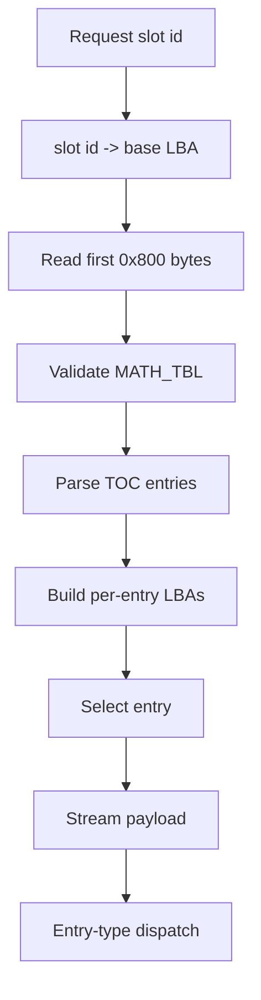

# EMI Loader Reverse Spec

This document tracks the game-specific EMI loading behavior implemented by `SLUS_004.22`.

It is intentionally separate from `../formats/emi.md`:

- `../formats/emi.md` describes the on-disc container format.
- this file describes how the main executable reads, validates, and streams EMI payloads into RAM.

## Status

- Confidence: medium
- Basis:
  - headless Ghidra analysis of `SLUS_004.22`
  - raw MIPS disassembly cross-checks with `mipsel-linux-gnu-objdump`
  - external corroboration from `third_party/references/BoF3-Data-Doc`

## High-Level Model

The main executable maintains a dedicated EMI streaming subsystem.

Current proven behavior:

1. Select a logical EMI slot id.
2. Resolve that slot to a base sector/LBA from a table in the main EXE.
3. Read the first `0x800` bytes into a working buffer.
4. Validate the header against `MATH_TBL`.
5. Walk the 16-byte TOC and compute per-entry sector offsets from entry sizes.
6. Select one payload entry from the TOC.
7. Stream that payload directly into the TOC `ram_ptr`.
8. Dispatch type-specific post-load logic from a per-type handler table.



The slot table has now been mapped against disc layout:

- `DAT_80182444` is a direct `slot id -> file start LBA` table.
- The LBA values match the regenerated disc LBA report derived from `build/Breath of Fire III (v1.1).xml`.
- `out/inventory/` now holds the canonical slot-to-LBA mapping.
- most slot entries resolve to EMI archives, but the tail of the table also covers direct `.STR` media and boot files such as `CAPCOM30.STR`, `LOGO.EXE`, `SYSTEM.CNF`, and `SLUS_004.22`.

Current unproven behavior:

- whether any relocation step exists for some overlay classes
- how many overlay families share the same callable-entry convention
- whether all code-bearing families use a local vector table before the first callable routine

## Function-Boundary Correction

The loader phase table and related dispatch tables do not point only at standalone functions.

Cross-checking with raw MIPS disassembly and the analyzed `SLUS_004.22` project shows that several table-target addresses are internal labels inside larger routines. In particular:

- `0x80162d9c`
- `0x80162da4`
- `0x80163230`
- `0x80163518`

should not be treated as stable standalone function starts.

Stable boundaries currently recovered from the same region include:

- `0x80162230` - active-entry service routine that decides whether to continue streaming, queue work, or dispatch the entry-type handler
- `0x80162b08` - TOC entry selector / active-entry latch helper
- `0x80162c14` - generic sector-copy helper used by several type handlers
- `0x80162d18` - phase-table dispatcher wrapper
- `0x8016305c` - outer EMI tick and ring-queue worker
- `0x80162d00` - ready predicate used by proven EXE-side overlay wrappers
- `0x80163308` - still not semantically stable; analyzed decomp currently looks like a loader-local staging helper rather than a clean TOC selector
- `0x80163418` / `0x80163518` - currently resolve inside an SPU/VAB-side transfer helper, not a stable generic loader-copy routine

Implication:

- preserve requested table-label addresses in inventories
- document the containing function separately
- do not blindly promote every table target into a standalone decompilation unit

## Confirmed Functions

### `FUN_80161fdc`

@source: 0x80161fdc FUN_80161fdc
@source: 0x8014ec6c FUN_8014ec6c

Role:

- initializes a fresh EMI transfer context
- clears slot state
- chooses a base sector/LBA from `DAT_80182444[param]`
- points the working buffer at `DAT_800e4800`
- schedules the first header read
- installs CD ready/sync callbacks

Observed pseudocode:

```c
void emi_stream_init(int slot_id) {
  reset_runtime_state();
  current_buffer = DAT_800e4800;
  current_slot_id = slot_id;
  current_base_lba = slot_to_lba[slot_id];
  current_header_lba = current_base_lba;
  select_payload(0);          // header mode
  remaining_size = 0x800;     // read header first
  install_cd_callbacks();
  arm_next_read();
}
```

Current corrected call-path evidence:

- the older generated caller inventory for this region is stale
- the corrected headless import now proves one full wrapper path:
  - `FUN_8014ec6c` calls `FUN_80161fdc(0x262)`
  - waits on `FUN_80162d00()`
  - then enters `GAME.EMI` at `0x801d0c04`
- current analyzed `SLUS_004.22` xrefs for `FUN_80161fdc` resolve direct calls at:
  - `0x8014eab4`
  - `0x8014ec6c`
- raw bytes still contain `jal 0x80161fdc` at:
  - `0x80161c04`
  - `0x8016732c`
- keep `0x80161c04` and `0x8016732c` as disassembly leads until function boundaries at those sites are promoted and xrefs become stable in the analyzed project

### `FUN_80162160`

Role:

- returns `DAT_80182444[param]`

Current interpretation:

- table lookup for the logical EMI slot base sector/LBA
- this interpretation is now confirmed by matching those values against the disc LBA log

### `FUN_80162178`

Role:

- resets transfer counters
- converts the current LBA to `CdlLOC`
- arms the next read state
- selects the next loader-phase dispatch entry

Observed pseudocode:

```c
void emi_arm_next_read(void) {
  read_progress = 0;
  retry_counter = 0;
  CdIntToPos(current_lba, &current_loc);
  loader_phase = 1;
  if (async_cd_resume != 0) {
    loader_phase = 6;
  }
}
```

## CD Callback Defaults And BIOS Helper Anchors

@source: 0x8017547c def_cbsync
@source: 0x801754a4 def_cbready
@source: 0x801754cc def_cbread
@source: 0x80175cc4 BIOS_OBJ_64
@source: 0x80176314 BIOS_OBJ_6B4
@source: 0x80176344 BIOS_OBJ_6E4
@source: 0x8017659c BIOS_OBJ_93C
@source: 0x801765cc BIOS_OBJ_96C
@source: 0x80176a0c BIOS_OBJ_DAC
@source: 0x80176a3c BIOS_OBJ_DDC

Within the SLUS loader/runtime control path, the default CD callback and BIOS-adjacent helper cluster is now signature-stable at medium confidence.

- default callback anchors:
  - `def_cbsync` (`0x8017547c`)
  - `def_cbready` (`0x801754a4`)
  - `def_cbread` (`0x801754cc`)
- interrupt decode/helper anchor:
  - `BIOS_OBJ_64` (`0x80175cc4`), int return with intr-code input
- status/poll helper anchors with int return:
  - `BIOS_OBJ_6B4` (`0x80176314`)
  - `BIOS_OBJ_6E4` (`0x80176344`)
  - `BIOS_OBJ_93C` (`0x8017659c`)
  - `BIOS_OBJ_96C` (`0x801765cc`)
  - `BIOS_OBJ_DAC` (`0x80176a0c`)
  - `BIOS_OBJ_DDC` (`0x80176a3c`)

Current interpretation:

- this cluster supplies low-level callback defaults and BIOS-facing interrupt/status polling helpers that sit directly under higher-level EMI stream state transitions
- retain these anchors as runtime-control facts; do not treat them as gameplay-level dispatch roots
- deterministic coverage in the SLUS helper window `0x80177104..0x8017929c` now also stabilizes prototype-level control-path helpers (`callback`, `cb_read`, `CDREAD_OBJ_46C`) and `ISO9660_OBJ_*` continuation tails at medium-high confidence for signature/role shape only (not full ISO9660 behavior semantics)
- closure pass confirms these callback/BIOS/ISO helper signatures are now fully cleared from the SLUS undefined-metadata tracker; remaining work in this region is behavior-level interpretation (call contracts and state effects), not function return-class recovery

### `0x80163308` (staging helper, provisional)

@source: 0x80163308 FUN_80163308

The analyzed `SLUS_004.22` pass no longer supports the older `emi_select_entry` label for this address.

Current observed decompile:

- copies `0x100` words from a loader-local buffer window into scratch RAM at `0x1f800000`
- then calls `FUN_80164064()`
- still has unresolved register-derived inputs in the decompiler output

Current interpretation:

- this address is more likely a loader-local staging or unpack helper than the canonical TOC-entry selector
- keep it documented as provisional until a caller-driven analysis proves its role

### `0x80163418` / `0x80163518` (audio-transfer cluster, not stable loader helpers)

@source: 0x80163418 FUN_80163418
@source: 0x80163518 internal label inside FUN_80163418

The analyzed `SLUS_004.22` pass contradicts the earlier cheap-pass interpretation of this region.

Current observed decompile:

- calls `SsVabTransCompleted`
- calls `SsVabTransBodyPartly`
- may call `SsSepOpenJ`
- updates audio-side globals such as `DAT_8014678c`, `DAT_8014678e`, and `DAT_80148fc0`

Current interpretation:

- this region belongs to an SPU/VAB-side transfer helper cluster
- do not treat `0x80163418` as a stable sector-copy helper
- do not treat `0x80163518` as a stable loader phase dispatcher
- keep both addresses as meaningful requested labels only, pending deeper caller-driven recovery

Resolved phase table targets:

| Phase | Target | Notes |
| ---: | --- | --- |
| `0` | `0x80162d9c` | internal label in header-parse / LBA-build routine |
| `1` | `0x80162da4` | internal label in the same routine |
| `2` | `0x80162e18` | queue bookkeeping label |
| `3` | `0x80162e70` | internal continuation label in the same routine |
| `4` | `0x80162e98` | graphics-side staging routine |
| `5` | `0x80162f04` | internal continuation label in the same routine |
| `6` | `0x80162f34` | internal continuation label in the same routine |
| `7` | `0x80162f88` | audio-side staging routine label |
| `8` | `0x80162d9c` | same label as phase `0` |
| `9` | `0x80163230` | queue-completion label in the outer work-handler path |

Important correction:

- phase-table entries are mixed labels and function starts
- the table is therefore a control-flow map, not a one-to-one function map
- in the current analyzed `SLUS_004.22` pass, `0x80163518` still resolves inside the larger `FUN_80163418` body
- keep `0x80163518` as a meaningful phase-table label, but do not treat it as a stable standalone function start yet

### `0x80162230` (`emi_service_active_entry`)

@source: 0x80162230 (CdReady callback body)

Role:

- services the currently selected EMI entry after a read completes
- either dispatches the entry-type handler, schedules another chunk, or advances to the next entry

Confirmed behavior:

- checks an in-flight state byte at `DAT_80146494`
- for specific entry types (`0`, `4`, `6`, `8`, `9`, `10`) it dispatches directly through the type-handler table at `0x80183248`
- for queued/streamed cases it waits for per-slot queue state in `DAT_801464a0`
- when more bytes remain, it schedules the next `0x800` chunk or the final partial read
- after a payload finishes, it advances the entry index and may call `emi_select_entry` again

Observed pseudocode:

```c
void emi_service_active_entry(void) {
  if (entry_transfer_state == 1 && transport_ready(1, 0)) {
    flush_stage_buffer();
    if (stage_buffer_tag == current_entry_stamp) {
      switch (current_type) {
      case 0:
      case 4:
      case 6:
      case 8:
      case 9:
      case 10:
        type_handlers[current_type]();
        break;
      default:
        if ((queue_state[current_queue_slot] & 0x80) == 0) {
          work_pending = 1;
          entry_transfer_state = 0;
          return;
        }
        break;
      }
    }
  }

  if (remaining_size != 0) {
    if (!issue_next_chunk_or_finalize()) {
      return;
    }
  }

  advance_entry_cursor();
}
```

## Loader Ring Queue

The outer EMI subsystem tick manages a small ring queue on top of the lower-level loader phases.

Current correction:

- `0x8016305c` is a stable outer tick entrypoint in the current `SLUS_004.22` analysis
- its queue-handler table targets still mix standalone starts and internal labels, so table entries should not be treated as one-to-one function starts

Confirmed behavior:

- the queue status array is `DAT_801464a0`
- `FUN_80161fdc` initializes all 0x18 bytes to `0xff`
- the poll cursor starts at `DAT_80146488 = 1`
- the poll index wraps back to `1` when it reaches `0x18`
- a queue byte with bit `0x80` set is treated as idle or empty
- otherwise, the low 7 bits index a 6-entry ROM work-handler table at `0x80149c60`

Resolved work-handler targets from that table:

| Queue index | Target |
| ---: | --- |
| `0` | `0x80163230` |
| `1` | `0x8016327c` |
| `2` | `0x80163238` |
| `3` | `0x80163378` |
| `4` | `0x80163418` |
| `5` | `0x80163698` |

The queue table has the same caveat as the phase table:

- entries such as `0x80163230` and `0x8016327c` are labels inside larger routines, not necessarily unique function starts

Observed outer-loop pseudocode:

```c
void emi_loader_tick(void) {
  if (force_rearm_flag != 0) {
    loader_status = 0;
    emi_arm_next_read();
  }

  emi_loader_phase_dispatch();

  while ((queue_state[queue_index] & 0x80) == 0) {
    queue_handlers[queue_state[queue_index] & 0x7f]();
    queue_state[queue_index] = 0xff;
    queue_index++;
    if (queue_index == 0x18) {
      queue_index = 1;
    }
    queue_timeout = 0;
  }

  if (queue_timeout > 300 && loader_status == 1) {
    emi_arm_next_read();
  }
}
```

Inference:

- slot `0` appears reserved or handled specially because the poll cursor starts at `1`, even though all 0x18 entries are initialized
- the 6 queue handlers appear to be stream-transport or callback-completion handlers layered above the lower-level phase table

## Family-To-Slot Mapping

`FUN_8016728c` resolves a higher-level BOF3 family selector plus a content index into one of four slot-id ranges before calling `FUN_80161fdc`.

Confirmed offsets:

| Family selector | Slot formula |
| ---: | --- |
| `0` | `index + 0x26a` |
| `1` | `index + 0x1db` |
| `2` | `index + 0x1ee` |
| `3` | `index + 0x27d` |

Observed pseudocode:

```c
void emi_request_family_slot(u8 index, u8 family) {
  int slot_id;

  switch (family) {
  case 0:
    slot_id = index + 0x26a;
    break;
  case 1:
    slot_id = index + 0x1db;
    break;
  case 2:
    slot_id = index + 0x1ee;
    break;
  case 3:
    slot_id = index + 0x27d;
    break;
  default:
    return;
  }

  emi_stream_init(slot_id);
}
```

Current interpretation:

- BOF3 runtime code often chooses a content family first, then a per-family index, then derives the actual slot id from one of these fixed ranges
- this is one of the clearest bridges between game-level requests and the raw `DAT_80182444` slot-to-LBA table

## Entry-Type Dispatch

The loader does not treat every EMI payload as a blind memory copy.

The logic around `0x80162298` and `0x80162420` reads the active TOC type from `DAT_80146460` and dispatches through a handler table at `0x80183248`.

Observed table entries:

| Type | Handler | Current interpretation |
| ---: | --- | --- |
| `0` | `0x801625e4` | direct CPU-RAM copy path |
| `1` | `0x80162618` | queued CPU-RAM load with slot bookkeeping |
| `2` | `0x80162618` | same handler as type `1`; meaning unresolved |
| `3` | `0x80162698` | image or VRAM-oriented load path |
| `4` | `0x80162500` | special handler present, meaning unresolved |
| `5` | `0x80162500` | same handler as type `4`; meaning unresolved |
| `6` | `0x80162790` | audio bank header path |
| `7` | `0x80162898` | audio bank body path |
| `8` | `0x801629f0` | audio auxiliary buffer path |
| `9` | `0x80162a6c` | audio or sequence-side auxiliary path |
| `10` | `0x80162a6c` | sequence path, same handler as type `9` |

This is the main proof that EMI is a runtime container, not just a passive archive.

Current correction:

- the table at `0x80183248` also behaves like a control-label table, not a guaranteed standalone-function table
- several entries land inside a shared post-load routine rather than at unique function starts
- this matches the broader loader pattern: BOF3 uses address tables as control labels aggressively

## Observed Code-Overlay Prefix Pattern

At least one confirmed code-bearing type-`0` payload begins with an overlay-local dispatch table.

Confirmed local example:

- archive: `emi_raw/BIN/BATTLE/BATTLE`
- entry: `15.bin`
- load address: `0x80096800`
- TOC `first4`: `17`
- payload first word: `0x00000011`

The next words are in-range code pointers inside the same payload:

```text
0x8009bc5c
0x8009bc80
0x8009bca4
0x8009bcc8
0x8009bcec
0x8009bd10
...
```

Those targets disassemble as real code and several behave like small state or mode handlers.

Current interpretation:

- for at least some type-`0` overlays, `first4` mirrors an overlay-local entry-count or dispatch-table count
- the payload does not necessarily begin with executable instructions
- the code blob may begin with a table of internal entry vectors followed by the real function bodies

Generated local evidence now lives in:

- `out/inventory/` (`entry_tables` plus related views)

Current local scan results:

- `100` candidate payloads across `6` grouped patterns
- strongest repeated groups:
  - `first4 = 17`, `ram_ptr = 0x80096800`, `size = 133316`, `42` members
  - `first4 = 16`, `ram_ptr = 0x801d0c00`, `size = 118224`, `42` members
  - `first4 = 24`, `ram_ptr = 0x801eec00`, `size = 15696`, `12` members

This strongly suggests BOF3 reuses a small number of overlay-local dispatch-table shapes across many duplicated battle, boss, and menu-like modules.

## Ready Gate And Proven Overlay Handoff

One complete EXE-to-overlay control transfer is now locally proven.

Confirmed sequence:

1. `0x8014ec6c` calls `FUN_80161fdc` with slot `0x262`
2. slot `0x262` resolves to `BIN/ETC/GAME.EMI`
3. the caller polls `0x80162d00`
4. once ready, `0x8014ec94` executes `jal 0x801d0c04`

`emi_raw/BIN/ETC/GAME/emi.json` shows:

- entry `0` -> `0x80195800`, size `229720`
- entry `1` -> `0x801d0c00`, size `4404`

`emi_raw/BIN/ETC/GAME/1.bin` begins with a non-code word `0x20` at `0x801d0c00`, and real code begins at `0x801d0c04`.

Current interpretation:

- for this proven path, the callable overlay entrypoint is `ram_ptr + 4`, not `ram_ptr`
- the load base contains module-local prefix data before the first instruction
- the caller waits on a loader-ready predicate before transferring control
- the overlay-side behavior after this handoff is documented in `game-overlay.md`

Observed pseudocode:

```c
void boot_game_overlay(void) {
  emi_stream_init(0x262);                // GAME.EMI
  while (!emi_ready()) {
    /* poll */
  }
  ((void (*)(void))0x801d0c04)();
}
```

This wrapper is documented from the current recovered loader path and matching exports.

### `0x80162d00` (`emi_ready`)

@source: 0x80162d00 FUN_80162d00

Role:

- completion predicate used by higher-level callers before entering loaded overlay code

Confirmed behavior:

- returns true only when `DAT_80146494 == 3`
- this state is reached after the outer loader tick observes `status == 2` and no queue work ran that tick

Current interpretation:

- "ready" means payload loading is complete and queue-drain/post-load staging is also finished
- callers should not enter loaded code as soon as the final sector copy finishes

Observed implications:

- headless function recovery should not assume the load base itself is a function start
- code-candidate heuristics should treat "small payload with a few pointers" differently from "large payload with internal dispatch table plus code"
- overlay-local dispatch tables are likely part of how the main runtime enters certain loaded code modules without hardcoding one symbol per EMI file

## Graphics-Side Loading

Type `3` entries are handled differently from plain CPU-RAM blobs.

Current proven behavior from the handler at `0x80162698`:

- the loader does not use `ram_ptr` as a normal destination pointer
- instead, it decodes fields out of `ram_ptr`
- it builds per-slot transfer words from those decoded values
- it then streams the image payload through that graphics-oriented path

Current interpretation:

- type `3` is the image/VRAM load path
- `ram_ptr` for these entries is a packed destination descriptor, not a CPU pointer
- this matches local samples such as `BATE.EMI` image entries using `0x1c080200` and `0x1a080200`

## Audio-Side Loading

Types `6`, `7`, `8`, and `10` are strongly tied to the PsyQ sound runtime.

Observed behavior:

- type `6`
  - uses the small numeric `ram_ptr` as a logical audio bank id
  - remaps it to a real runtime buffer
  - copies the payload there
- type `7`
  - references `SpuSetTransferMode`
  - references `SsVabClose`
  - references `SsVabOpenHeadSticky`
  - this is the strongest current evidence that type `7` is the VAB body streaming path following a previously loaded header
- type `8`
  - remaps the bank id to a second audio-side buffer and copies the payload there
- type `10`
  - remaps the bank id to a third audio-side buffer and copies the payload there
  - local EMI samples with type `10` begin with `SEQp`, confirming sequence content

Current interpretation:

- EMI audio payloads are not loaded by fixed file paths into ad hoc buffers
- the EXE treats the TOC `ram_ptr` as a logical bank selector
- the handler rewrites that selector into concrete runtime buffers and PsyQ calls

## Unload Or Replacement Behavior

Only part of unload behavior is currently proven.

Proven:

- audio replacement explicitly closes or resets prior state when reusing a bank
  - `SsVabClose`
  - `SsSepClose`
  - `SsUtAllKeyOff`

Strong inference:

- code and many non-audio assets are "unloaded" by being overwritten in shared RAM regions
- recurring overlay addresses such as `0x801d0c00`, `0x801eec00`, `0x8003b800`, and `0x80104000` suggest family-local working regions rather than permanently resident modules

### Header validation and TOC parsing in `0x80162500`

Confirmed behavior:

- compares bytes `0x08..0x0F` of the loaded header against `MATH_TBL`
- on success, computes aligned per-entry sector offsets using the TOC sizes

Observed pseudocode:

```c
bool emi_parse_header(void *header) {
  if (memcmp(header + 8, "MATH_TBL", 8) != 0) {
    mark_loader_error();
    return false;
  }

  entry_lba_table[0] = base_lba + 1;   // first payload starts after header sector
  for (u32 i = 1; i < toc_count; i++) {
    entry_lba_table[i] =
      entry_lba_table[i - 1] + ((toc[i - 1].size + 0x7ff) >> 11);
  }
  return true;
}
```

This logic lives in `0x80162500` (type-`4/5` handler target from `0x80183248`) and is called by the active-entry service path after header-sector reads.

## Data Tables

### `DAT_80182444`

Observed content:

- a long table of small monotonic 32-bit values
- enough entries to cover the extracted disc files through `LOGO.EXE`, `SYSTEM.CNF`, and `SLUS_004.22`

Current interpretation:

- logical EMI slot -> base LBA/sector table

Confirmed examples:

- slot `0` -> `0x19` -> `BATL_DRA.EMI`
- slot `1` -> `0x3c` -> `BATL_END.EMI`
- slot `2` -> `0x65` -> `BATL_OVR.EMI`
- slot `6` -> `0xeb` -> `BATTLE.EMI`
- slot `7` -> `0x241` -> `BATTLE2.EMI`
- slot `883` -> `CAPCOM30.STR`
- slot `884` -> `LOGO/LOGO.EXE`
- slot `885` -> `SYSTEM.CNF`
- slot `886` -> `SLUS_004.22`

The mapping was confirmed by regenerating the disc-LBA inventory from
`build/Breath of Fire III (v1.1).xml`, persisting the canonical rows into
`out/inventory/`, and then comparing those LBAs against
the table values in `SLUS_004.22`.

Current interpretation:

- the table has at least `887` meaningful slot entries for the US v1.1 build
- this is a full disc file map, not a tiny battle-only resource table

## Higher-Level Slot Selection

### `FUN_8016728c`

Role:

- maps a higher-level content request into a concrete EMI slot id
- then calls `FUN_80161fdc(slot_id)`

Observed pseudocode:

```c
void request_overlay_family(u8 index, u8 family) {
  int slot_id;

  switch (family) {
    case 0: slot_id = index + 0x26a; break;
    case 1: slot_id = index + 0x1db; break;
    case 2: slot_id = index + 0x1ee; break;
    case 3: slot_id = index + 0x27d; break;
    default: return;
  }

  emi_stream_init(slot_id);
}
```

Current known caller examples:

- `FUN_801656f4`
- `FUN_80165760`

Current local wrapper patterns:

```c
void FUN_801656f4(u8 a, u8 b, u8 c) {
  u8 index = FUN_80166ff8(a, b, c);
  if ((current_selection & 0x7f) != index) {
    FUN_8016728c(index, 3);
  }
}
```

```c
void FUN_80165760(u8 index, u8 family_flag) {
  if (family_flag == 0) {
    if (current_selection == (index | 0x80)) {
      return;
    }
  }
  else if (current_selection == index) {
    FUN_80166fe4();
    return;
  }

  FUN_8016728c(index, family_flag);
}
```

Current interpretation:

- `FUN_801656f4` computes a content id with `FUN_80166ff8` and then requests `family 3`
- `FUN_80165760` is another higher-level wrapper around `FUN_8016728c`
- both functions contain fast paths that avoid or short-circuit redundant reloads based on `DAT_80145024`

Confirmed file-family examples from the slot table:

- `index 0x12`, `family 1` -> slot `0x1ed` -> `BPLCHAR/BPLD012.EMI`
- `index 0x12`, `family 2` -> slot `0x200` -> `BPLCHAR/BPLU012.EMI`
- `index 0x12`, `family 0` -> slot `0x27c` -> `PLCHAR/PL012.EMI`
- `index 0x12`, `family 3` -> slot `0x28f` -> `PLCHAR/PLP012.EMI`

Current interpretation:

- `index` is probably a character/form/content id
- `family` selects one of several related EMI families for that same id
- naming strongly suggests that at least one caller is selecting playable-character related overlays/assets

Known direct callers of `FUN_80161fdc` from the current loader analysis set:

- `FUN_8014d238` at `0x8014d238`
- `FUN_8014d41c` at `0x8014d41c`
- `FUN_80160374` at `0x80160374`
- `FUN_80165a44` at `0x80165a44`

One direct-wrapper caller is now partially understood:

```c
u32 FUN_80165a44(u8 index, u8 family) {
  if (family == 3) {
    return FUN_80161fdc(index + 0x27d);
  }

  // other families also update shared state/tables before returning
}
```

Current interpretation:

- some higher-level systems call `FUN_80161fdc` directly once the family-to-slot bucket is known
- `FUN_80165a44` is one of the clearest bridges between family selection and raw slot loading

Another direct caller now has a defensible provisional role:

```c
bool FUN_80160374(u8 selector_index) {
  if (DAT_80145029 == 0xff ||
      DAT_80181eb8[selector_index].id != DAT_80181eb8[DAT_80145029].id) {
    FUN_80161fdc();
    return true;
  }
  return false;
}
```

Current interpretation:

- `FUN_80160374` looks like a small `ensure selection changed -> reload` wrapper
- it compares `DAT_80181eb8` metadata for a requested selector against the currently active selector in `DAT_80145029`
- this strengthens the interpretation that `DAT_80181eb8` participates in higher-level overlay or content selection state, not just raw slot bookkeeping

### `DAT_80181eb8`

Observed content:

- 24 records of 4 bytes each
- low 16 bits look like ids such as `209`, `213`, `216`, ...
- high bytes vary in a small range

Current interpretation:

- logical EMI slot metadata used by higher-level selection code
- exact semantics still unresolved

## External Corroboration

The locally cloned BOF3 data docs add one important game-specific claim:

- certain EMI files begin with a "GameMode executable"
- these are PSX/MIPS overlays
- many of them reportedly load at `0x801D0C00`

Source files:

- `third_party/references/BoF3-Data-Doc/src/DataStructures/2_GameModeExecutable.md`
- `third_party/references/BoF3-Data-Doc/src/DataContent/1_STATUS.EMI.md`

Current use in this repo:

- treat `0x801D0C00` as a strong heuristic for menu/game-mode overlays
- do not yet treat it as universal without broader local verification

## Working Implications

- EMI code-bearing entries should be modeled as overlay-style payloads loaded directly to `ram_ptr`.
- The first callable instruction of a code overlay may live after a module-local prefix or vector table, not at `ram_ptr` itself.
- The main EXE already computes per-entry disc positions from the TOC, so any extraction/import tooling should preserve TOC order and 0x800 alignment.
- A correct emulator/debugger validation pass should be able to confirm:
  - logical slot id chosen
  - base LBA from `DAT_80182444`
  - header read into `DAT_800e4800`
  - `MATH_TBL` validation
  - target `ram_ptr`
  - the loader-ready gate
  - eventual execution transfer into the loaded code

## Open Questions

- What are the exact gameplay/system roles of the remaining `FUN_80161fdc` direct callers: `FUN_8014d238`, `FUN_8014d41c`, and `FUN_80160374`?
- Which on-disc EMI archives correspond to each `DAT_80182444` slot?
- What exact condition tells the loader to execute a loaded code-bearing payload?
- Are battle overlays and menu/game-mode overlays handled identically after load?
- Is there any relocation/import fixup path hidden in another loader state?
