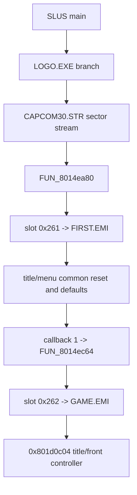

# FIRST Frontend Pack

This document records the EXE-side title bootstrap that runs after
`LOGO.EXE` returns and before `GAME.EMI` takes control.

Target archive:

- `emi_raw/BIN/ETC/FIRST`

## Proven `SLUS` Handoff

`SLUS_004.22` returns from the logo branch and then enters a small EXE-side
bootstrap rooted at `0x8014ea80`.

@source: 0x8014ea80 FUN_8014ea80
@source: 0x8014ec64 FUN_8014ec64
@source: 0x8014ec6c FUN_8014ec6c

Observed pseudocode:

```c
void boot_title_common(void) {
  title_reset_display();
  scheduler_yield(1);
  title_audio_reset();
  title_layout_reset(0);

  emi_stream_init_slot(0x261);   // FIRST.EMI
  while (!emi_ready()) {
    scheduler_yield(1);
  }

  title_apply_common_pack();
  install_callback_slot(1, 0x8014ec64);
  exit_current_callback();
}

void boot_game_overlay(void) {
  emi_stream_init_slot(0x262);   // GAME.EMI
  while (!emi_ready()) {
    scheduler_yield(1);
  }
  ((void (*)(void))0x801d0c04)();
}
```

Current interpretation:

- `FIRST.EMI` is a common title/menu pack loaded before the title controller
- the pack is prepared by `0x8014ea80`
- once that common state is installed, `SLUS` schedules the next callback at
  `0x8014ec64`
- `0x8014ec64` and `0x8014ec6c` are equivalent tiny wrappers that load
  `GAME.EMI` and enter `0x801d0c04`



## `FIRST.EMI` Layout

Manifest summary:

- entries `0-2`
  - audio header, small control blob, and audio body
- entries `3-7`, `12`
  - image payloads
- entries `8-10`, `13`
  - small type-`0` payloads currently decoding like image/palette-style data,
    not trustworthy executable code
- entry `11`
  - large type-`0` payload at `0x8001a000`
  - exact duplicate of `BIN/ETC/AFLDKWA/0.bin`
  - currently decodes as tables and menu/system text, not a stable code module

Concrete local evidence from entry `11`:

- plain-text menu/system strings include:
  - `Status`
  - `Items`
  - `Equip`
  - `Ability`
  - `Tactics`
  - `Config`
  - `Camp`

Current interpretation:

- `FIRST.EMI` is not the title-state controller itself
- it is the common title/menu asset/text/audio pack that the controller expects
- the earlier code-candidate heuristic overclassified several `FIRST.EMI`
  type-`0` payloads as code

## Runtime Meaning

For PSX recovery:

1. keep the `SLUS -> FIRST -> GAME` control-flow shape explicit
2. model `FIRST.EMI` as a common title/menu resource pack, not as a gameplay
   overlay
3. treat this pack as already loaded before the `GAME.EMI` title controller
   begins dispatching
