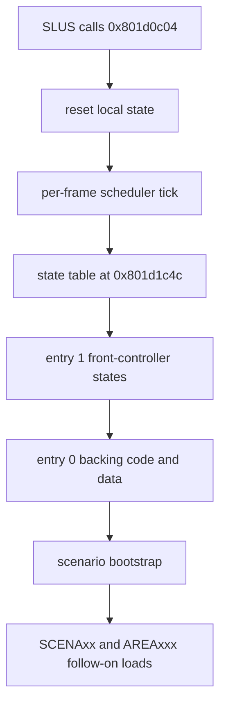

# GAME.EMI Overlay

This document records the first representative BOF3 overlay recovered far enough to guide PSX runtime recovery work.

Target archive:

- `processed/emi_raw/BIN/ETC/GAME`

Relevant entries:

- entry `0`
  - load address `0x80195800`
  - large backing code/data segment
- entry `1`
  - load address `0x801d0c00`
  - small front controller
  - proven callable entrypoint `0x801d0c04`

## Why This Overlay Matters

`GAME.EMI` is the first overlay family with a locally proven end-to-end call path:

1. `SLUS_004.22` returns from `LOGO.EXE`
2. `SLUS_004.22` loads `FIRST.EMI` through `0x8014ea80`
3. callback `0x8014ec64` requests slot `0x262`
2. slot `0x262` resolves to `BIN/ETC/GAME.EMI`
3. the caller waits until `emi_ready()`
4. control transfers to `0x801d0c04`

That makes it the best current overlay recovery candidate.

## Proven SLUS Handoff Wrapper

The top-level EXE-side wrapper for this overlay is now locally recovered.

@source: 0x8014ec6c FUN_8014ec6c
@source: 0x80161fdc FUN_80161fdc
@source: 0x80162d00 FUN_80162d00

Observed pseudocode:

```c
void front_scene_boot_wrapper(void) {
  FUN_80161fdc(0x262);   // request BIN/ETC/GAME.EMI
  while (FUN_80162d00() == 0) {
    func_0x8014b87c(1);  // yield one scheduler slice while loading
  }
  func_0x801d0c04();     // enter GAME.EMI entry 1 at ram_ptr + 4
}
```

Why this matters:

- this is the cleanest current EXE-to-overlay handoff seam in the whole game
- the BOF3-shaped path is now explicit:
  - request slot
  - poll loader ready
  - enter overlay

## High-Level Shape

Entry `1` is not a standalone mode implementation. It is a front controller that:

- runs a non-returning local loop
- dispatches through an 8-entry state table at `0x801d1c4c`
- uses entry `0` as a backing code/data segment
- assumes `FIRST.EMI` has already installed the common frontend pack
- continues to call back into the generic EMI loader for secondary archives such as `DEMO.EMI` and `SCENA16.EMI`



## Entry 1 Front Controller

`0x801d0c04` behaves like a top-level mode loop, not a one-shot init routine.

@source: 0x801d0c04 FUN_801d0c04

Observed pseudocode:

```c
void front_scene_main_loop(void) {
  state = 0;
  local_flag = 0;
  scheduler_reset();
  for (;;) {
    scheduler_yield(1);
    front_scene_pre_dispatch_gate();
    state_table[state]();
    game_tick_banner_fx();
    game_tick_window_fx();
  }
}
```

### State Table

These names are provisional, but each one is backed by behavior rather than by file name only.

| Address | Suggested name | Confidence | Role |
| --- | --- | --- | --- |
| `0x801d0c90` | `game_state_request_demo` | medium | requests slot `0x25f` (`DEMO.EMI`), waits for loader ready, seeds active selection cue `0x8d` with `(100, 8)`, then initializes local fade and window state |
| `0x801d0d5c` | `game_state_wait_fade_phase_2` | medium | waits until the local fade phase reaches `2`, then arms a countdown |
| `0x801d0d94` | `game_state_countdown_to_open` | medium | decrements the main timer, then arms fade and window animation and advances |
| `0x801d0df0` | `game_state_open_selection_fx` | medium | closes mode `0`, opens selection FX for the active selection, then advances |
| `0x801d0e54` | `game_state_boot_scenario16` | high | clears transient flags, closes selection FX, resets local records, boots scenario `0x10`, installs callback `0x80197068` |
| `0x801d0f00` | `game_state_wait_selection_load` | medium | waits for a clear submode, then on ready plus input arms local mode `4`, fades the active selection cue, and advances |
| `0x801d0fb8` | `game_state_wait_return_or_reset` | medium | returns to state `0` when the subordinate mode clears, otherwise keeps processing popup work |
| `0x801d1000` | `game_state_finalize_exit` | medium | closes selection FX, restores mode `0`, installs callback `0x80196f78`, then calls the EXE slot/thread exit helper `0x8014b8b0` |

### Pre-Dispatch Gate

`0x801d104c` runs before the state handler each frame.

@source: 0x801d104c FUN_801d104c

Suggested name:

- `front_scene_pre_dispatch_gate`

Role:

- if the input gate is enabled
- and pad bit `0x800` is pressed
- and `emi_ready()` is true
- and neither the overlay-local nor subordinate mode is busy

then:

- for early states, forces a jump to state `2`
- for later states, if `pending_popup_flags` matches `0x20000`, closes mode `0`, opens selection FX, queues transition `0x105`, and jumps to state `7`

## Entry 1 Helper Roles

| Address | Suggested name | Confidence | Role |
| --- | --- | --- | --- |
| `0x801d1134` | `game_open_selection_fx` | medium | opens a selection-specific EXE effect using the current selection byte |
| `0x801d1184` | `game_close_selection_fx` | medium | closes the selection effect and clears the active selection byte |
| `0x801d11e4` | `game_handle_pending_popup_fx` | low | checks local mode flags, selects one of two popup resources, queues an EXE-side effect, and spawns UI geometry |
| `0x801d17d8` | `game_spawn_ui_quad` | medium | fills one UI record from a local table near `0x801d1c6c` |
| `0x801d18f8` | `game_tick_banner_fx` | medium | updates a 4-piece banner or fade animation and spawns matching UI quads |
| `0x801d1b00` | `game_tick_window_fx` | medium | updates two alpha tracks and forwards them into three local draw helpers |

## Supporting EXE Helper Contract

These EXE-side helpers are now locally exported/decompiled from `SLUS_004.22` and are the next concrete contract surface underneath the `GAME.EMI` handoff.

| Address | Suggested name | Confidence | Role |
| --- | --- | --- | --- |
| `0x8014b73c` | `game_slot_scheduler_tick` | high | scans the slot control table, opens/switches ready callback threads, and is the concrete EXE-side dispatcher below the overlay callback installs |
| `0x8014b854` | `game_install_callback_slot` | high | writes a callback or continuation pointer into a slot-based control block and marks the slot active with state `2` |
| `0x8014b87c` | `game_slot_scheduler_yield` | high | marks the current slot as yielded for a fixed countdown, then `ChangeTh`s away for one frame |
| `0x80161b24` | `game_activate_selection_slot_and_cue` | medium | takes a selection id plus two cue parameters, conditionally requests the mapped slot when the selector changed, waits on loader ready, then updates the active selection cue |
| `0x80161b50` | `game_sync_selection_slot_and_cue` | medium | requests a selection-dependent slot if its mapped id differs from the active selector, waits for loader ready when needed, then updates the active selection cue |
| `0x80161bbc` | `game_request_selection_slot_if_changed` | medium | compares the requested selector's 16-bit id in `DAT_80181eb8` against the current selector and calls `emi_stream_init_slot(id)` only when it changes |
| `0x80161c20` | `game_set_active_selection_cue` | high | starts the selection-associated SEP and records the current selection id plus cue level in `DAT_80145029` / `DAT_80143f20` |
| `0x80161cd0` | `game_fade_selection_cue` | high | validates a selection id and forwards its per-selection table bytes into `0x8015d554`, which decrescendos and stops the SEP |
| `0x8015df18` | `game_queue_frontend_cue` | medium | stores the low byte and bank nibble of a cue/event id, dispatches through a banked table at `0x8018232c`, then resets cue-side bookkeeping |
| `0x8014ecac` | `game_set_local_mode_callback` | medium | stores a one-byte local mode id, then installs callback `0x8014ed6c` into callback slot `2` |
| `0x80161808` | `game_set_frontend_layout_bank` | medium | builds a large frontend/layout pointer set from ROM tables indexed by the requested mode id |
| `0x8015d4f8` | `game_open_selection_fx` | high | sets shared FX bounds to `0x3ff`, then opens a selection-specific effect through `0x8016b054` |
| `0x8015d404` | `game_close_selection_fx` | high | closes a selection-specific effect through `0x8016d6c4` |
| `0x8014b8b0` | `game_exit_current_callback_thread` | medium | clears the current slot state, enters/exits a short critical-section pair, closes the current child thread, then forces a `ChangeTh(0xff000000)` away from the current callback |

Current correction:

- `0x80161cd0` is not the actual selection-load dispatcher
- the saved analyzed `SLUS` project now shows it is the cue fade/stop helper that wraps `0x8015d554`
- `0x8015df18` should no longer be treated as a proven scene-transition dispatcher:
  - current `SLUS` decompilation shows it behaves like a banked audio/event cue helper
  - the ids seen on the title and `SCENA16` paths (`0x105`, `0x213`, `0x214`) are therefore best treated as cue/event ids unless a later module proves scene semantics directly
- the saved analyzed `SLUS` project now shows the containing wrapper at `0x80161b24`:
  - accept `selection_id`, `cue_level`, and `cue_shape`
  - request the mapped slot only when the selector changed
  - wait for `0x80162d00`
  - then update the active selection cue through `0x80161c20`
- `0x80161b50` is an internal label inside that wrapper, not a standalone external entrypoint
- `0x80161bbc` is already reused by overlay code outside the title loop:
  - `SCENA16` calls `func_0x80161bbc(6)` at `0x801f6ccc`
  - this strengthens the interpretation that the helper is a common selector-to-slot request bridge exported by `SLUS`, not a title-only local leaf
- `GAME.EMI` entry `1` state `0` also seeds the active selection cue directly through `0x80161c20(0x8d, 100, 8)` before the menu opens
- `0x8014b8b0` is now locally stronger than the earlier low-confidence note:
  - it is not itself the gameplay module
  - it is the EXE-side slot/thread exit seam immediately below the last recovered frontend-owned states
- the next confirmed EXE-side dispatcher below that seam is the slot scheduler:
  - `0x8014b73c` opens/switches ready callback threads
  - this is the strongest current next-step module below `0x8014b8b0`, even though the first true gameplay module is still unresolved

## Entry 0 Backing Segment

Entry `0` at `0x80195800` is not passive data. It begins with a local vector table and contains callable code used by the front controller.

@source: 0x8019611c FUN_8019611c
@source: 0x801a7704 FUN_801a7704

Two already-useful targets are:

| Address | Suggested name | Confidence | Role |
| --- | --- | --- | --- |
| `0x80196f78` | `game_alt_front_callback_loop` | medium | alternate `GAME.EMI` entry-0 callback loop installed by `0x801d1000`; resets local loop state, then dispatches through `PTR_FUN_801c7b08[_DAT_80143b90]` |
| `0x80196ffc` | `game_boot_start_pack` | medium | requests slot `0x268` = `START.EMI`, waits for loader ready, marks the frontend pack dirty, then advances the local state |
| `0x80197068` | `game_selection_callback_loop` | high | main `GAME.EMI` entry-0 selection callback loop installed by `0x801d0e54`; dispatches through `PTR_FUN_801c7b14[_DAT_80143b90]` |
| `0x8019611c` | `game_reset_local_records` | high | loops over 20 local records and resets each one through `0x801960c0` |
| `0x801a7704` | `game_boot_scenario` | high | stores a scenario index, clears adjacent state, requests `SCENA[index]`, waits for loader ready, then dispatches into a scenario-local jump table |

Corrected local helper grouping came from analyzed overlay queries against the
saved `GAME.EMI#0` and `SCENA16.EMI#0` programs, then was folded back into the
canonical inventory and module docs.

The earlier `game_emi_entry0_bootstrap_raw.json` export was not trustworthy.
The payload itself is valid code; the fix was to query the saved analyzed
overlay project with the correct project-file path.

## Entry 0 Title-Selection Authoring Cluster

The title-selection byte consumed by the EXE-side helper at `0x80161b24` is no
longer an unresolved mystery.

The currently strongest local model is:

- `DAT_80143f1f`
  - authored selection byte owned by `GAME.EMI` entry `0`
- `DAT_80145029`
  - active selection/cue byte owned by the EXE-side selection helper cluster

Proven writer and seed sites:

| Address | Suggested name | Confidence | Role |
| --- | --- | --- | --- |
| `0x801970ec` | `game_front_reset_selection_state` | medium | resets front-state globals, then seeds `DAT_80143f1f` from `DAT_80145029` when a previous active selection exists |
| `0x8019fa28` | `game_front_apply_selection_layout` | high | writes the current title layout tuple to `DAT_80143f10..1c`, then calls `0x801a0380` to author the selection byte |
| `0x801a0048` | `game_front_hit_test_selection_layout` | medium | resolves a layout/table hit from the current front record, updates `DAT_80143f10..1c`, then calls `0x801a0380` |
| `0x801a0380` | `game_front_author_selection` | high | resolves the current authored menu selection and writes `DAT_80143f1f` |

Supporting writer/reader grouping was derived from focused data-ref, caller, and
function queries against the analyzed `GAME.EMI#0` overlay, then persisted into
the canonical inventory and this spec.

Observed pseudocode:

```c
void game_front_apply_selection_layout(layout_id, x, y, flags) {
  DAT_80143f10 = layout_id;
  DAT_80143f14 = x;
  DAT_80143f18 = y;
  DAT_80143f1c = flags;
  game_front_sync_layout_state();
  game_front_author_selection(x >> 16, y >> 16, layout_id);
  DAT_80143bb0 = 5;
}

void game_front_author_selection(short x, short y, short layout_id) {
  selection_id = DAT_80145029;
  if (!front_selection_lock_active()) {
    selection_id = resolve_layout_selection(layout_id, x, y);
  }
  DAT_80143f1f = selection_id;
}
```

Current interpretation:

- the title/frontend selection value is authored in `GAME.EMI` entry `0`
- `GAME.EMI` entry `1` consumes the result indirectly through the EXE helper
  cluster
- the first concrete direction-step table for this cluster is now proven:
  - `0x801c7b74` stores signed `(dx, dy)` pairs used by `0x80197aa4`
  - recovered bytes: `(4, 0)`, `(0, 4)`, `(-4, 0)`, `(0, -4)`
- the direction index consumed by that table lives in `DAT_801462ec`
- two additional locally proven writers now matter for this cluster:
  - `0x801bfe34` seeds `DAT_801462ec` from the 4-byte pattern table at `0x801cd78d` before repositioning front objects
  - `0x801c60e0` also writes `DAT_801462ec` in a later front-layout path before calling `0x801c7244`

### Special `0xbd` Frontend Staging Area

One durable title/frontend exception should stay explicit:

- `_DAT_80143f00 == 0xbd` behaves like a special frontend staging area, not a
  normal direct route id
- the later frontend path can remap that staging area into follow-up ids
  `0xbf` or `0xc0`
- this strengthens the current interpretation that `0xbd` is a local
  title/menu staging state rather than a final gameplay destination

Keep this distinction separate from the authored selection byte
`DAT_80143f1f`, which still holds the locally proven `NEW` / `LOAD` choice.

## Related Frontend Packs

The title/front controller is not a standalone archive.

- `FIRST.EMI` is loaded first by the main EXE and behaves like a common
  frontend resource pack
- `DEMO.EMI` is then requested by state `0`
- current local classification of `DEMO.EMI` shows audio plus image payloads,
  and its small type-`0` candidate currently decodes like data rather than a
  trustworthy code module

Current interpretation:

- `GAME.EMI` entry `1` owns the title/front-controller state machine
- `FIRST.EMI` supplies common frontend text/audio/image content
- `DEMO.EMI` supplies title/demo presentation assets underneath the controller

### Scenario Bootstrap Cluster

`0x801a7704` calls:

@source: 0x801a7804 FUN_801a7804
@source: 0x801a782c FUN_801a7804+0x28

- `0x801a7804`
  - suggested name: `game_request_scenario_archive`
  - role: requests slot `0x295 + scenario_index` through `emi_stream_init_slot`
- `0x801a782c`
  - suggested name: `game_enter_scenario_archive`
  - role: loads a scenario-local function pointer from a table at `0x801d8454`, calls it, then continues with `0x801a7bf0`

Observed pseudocode from the corrected export:

```c
void game_boot_scenario(uint8_t scenario_index) {
  game_scenario_index = scenario_index;
  clear_game_scenario_locals();
  game_scenario_state_ptr = &game_scenario_state_table[scenario_index];

  game_request_scenario_archive();

  while (!emi_ready()) {
    if (frontend_transition_id != 0xffff && frontend_mode != 5) {
      game_tick_frontend_side_work();
    }
    scheduler_yield(1);
  }

  game_enter_scenario_archive(game_scenario_dispatch_root[scenario_index]);
}
```

This is the first proven chain from the `GAME` overlay into concrete game progression content:

`GAME.EMI entry 1 -> GAME.EMI entry 0 -> SCENA16.EMI -> scenario-local dispatch`

Additional proven area-selection note:

- `DAT_80143f00` is not best described here as a generic frontend mode byte
- in the proven area-load path through `0x8019faa0`, entry `0` writes an area/archive id to `DAT_80143f00`
- that helper then requests slot `id + 0x2ab` and indexes multiple per-area tables from the same id
- currently proven examples are `2 -> AREA002`, `4 -> AREA004`, and `0x1f -> AREA031`

@source: 0x8019faa0 FUN_8019faa0

That scenario-local dispatch is no longer opaque. The next layer is now documented in:

- `runtime/scena16-overlay.md`

Current proven SCENA16 shape:

- dispatch root for scenario `0x10` is `0x801f8538`
- first word of that object is `0x801f6c90`, the top dispatcher
- the primary state table starts at `0x801f854c`
- top-level phase selector at `DAT_80146874`
- first local controller at `0x801f7230`
- second local controller at `0x801f7790`
- third local controller at `0x801f7cc4`
- cleanup path at `0x801f7188`

## Related EXE Helper Roles

These helpers sit directly underneath the `GAME.EMI` handoff and are strong current naming candidates.

| Address | Suggested name | Confidence | Role |
| --- | --- | --- | --- |
| `0x80161fdc` | `emi_stream_init_slot` | high | clears the EMI runtime state, records the requested slot id, resolves the base LBA, selects header mode, installs CD callbacks, and arms the first read |
| `0x80162d00` | `emi_ready` | high | analyzed `SLUS_004.22` decomp now shows this returns `DAT_80146494 == 3`, matching the proven wrapper-ready behavior |
| `0x80163418` | `loader_or_audio_stage_helper` | low | analyzed decomp currently resolves this region inside an SPU/VAB-side transfer helper using `SsVabTransBodyPartly` and `SsSepOpenJ`; do not treat it as a stable generic EMI copy/read helper |

## Recovery Implication

The first practical recovery target is not "all of GAME.EMI."

It is:

1. preserve the original slot and EMI request flow
2. recover `0x801d0c04` as the front controller entry
3. keep secondary asset and archive loads alive underneath it
4. progressively replace:
   - `game_reset_local_records`
   - `game_boot_scenario`
   - selection FX helpers
   - popup, window, and banner helpers

That keeps the BOF3 runtime shape intact while narrowing the highest-value recovered control surface.
