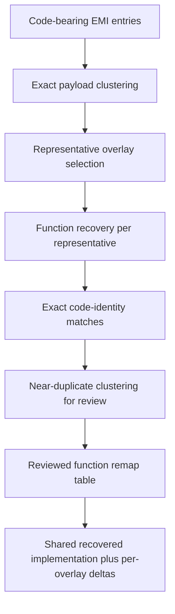

# Overlay Duplication

This document captures a durable BOF3 reverse-engineering constraint: code duplication across EMI overlays is normal and should be expected.

## Status

- Confidence: high
- Basis:
  - local overlay candidate catalogs and duplicate-group counts
  - repeated load-address clusters across many EMI families
  - external reverse-engineering guidance from experienced BOF3 researchers

## Core Rule

Do not assume one code-bearing EMI payload equals one unique implementation.

In BOF3 it is normal to see:

- identical code blobs copied into multiple EMI archives
- the same function duplicated across multiple overlays
- near-duplicate functions with only small deltas
  - different locals
  - different constants or arguments
  - small guard logic differences
  - one or two extra conditionals

## Why This Happens

Current interpretation:

- the game duplicates code and related assets across overlays to improve CD-ROM loading behavior and reduce cross-overlay dependencies at runtime
- the shipped game prioritizes load-time locality and integration convenience over minimizing binary size

This means duplicate code should be treated as a property of the original build, not as a mistake in extraction.

## Reverse-Engineering Consequence

A valid decompilation strategy needs more than per-file lifting.

It needs:

1. exact payload dedupe
2. conservative function correspondence analysis
3. normalized or fuzzy function clustering for review candidates
4. a remap table only for functions whose shared implementation is actually
   proven

Important rule:

- do not merge functions only because they share a decompiler prototype,
  parameter count, or apparent call signature
- in BOF3, those similarities are too weak and may hide different local
  behavior, constants, or side effects
- exact byte identity, relocation-aware code identity, strong CFG similarity,
  constant/table evidence, and caller context are all stronger signals than a
  recovered signature

## What To Prefer

For this repo, prefer this order:

1. cluster whole overlay payloads by exact hash
2. identify representative overlays by family and load address
3. recover functions from representatives first
4. map exact duplicate overlays back onto those representatives
5. treat function-level matches as review candidates until code identity or
   semantic equivalence is defensible
6. only then widen m2c/decomp work

## Current Local Evidence

Local generated artifacts already show exact duplicate pressure:

- `processed/inventory/inventory.sqlite`

Representative local patterns already visible:

- `BATTLE` and `BATTLE2` share large battle-core payloads
- many `BOSS` overlays share battle-core regions and add small boss-local deltas
- `WORLD*` families repeat common world/area templates heavily
- `BMAGIC` contains large families of repeated or closely related effect overlays
- `BPLCHAR` and `PLCHAR` group into stable family buckets rather than purely unique modules

## Recovery Consequence

For PSX decomp planning:

- one recovered implementation may legitimately represent many original overlay copies
- the analysis still needs a remap layer so original slot ids and load requests can resolve to the correct shared implementation
- per-overlay deltas should remain explicit instead of being silently merged away

## Open Work

- build conservative function-level correspondence detection from recovered
  disassembly/decompiler output
- add fuzzy near-duplicate clustering for functions that differ only slightly
- derive a formal function-remap table for decomp promotion
  only where equivalence is actually proven
