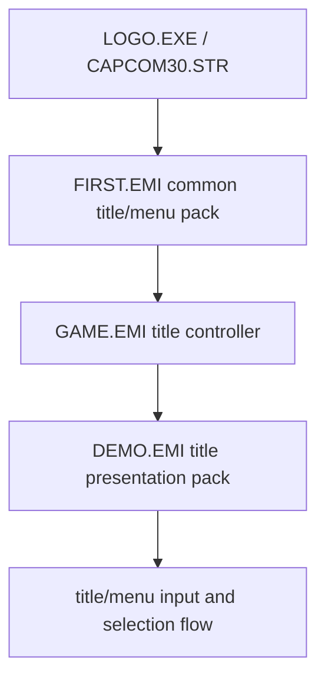

# Title Assets

This document captures the concrete title/menu asset packs that sit underneath
the `SLUS -> FIRST -> GAME` title flow.

It exists to separate:

- code/control flow in `GAME.EMI`
- common title assets in `FIRST.EMI`
- title presentation assets in `DEMO.EMI`

## Current Title Target

For the first full BOF3 title-flow recovery, the practical target is:



We can skip the console BIOS boot path. The real recovery target is the game
boot path starting at `SLUS_004.22`.

## `FIRST.EMI`

Archive:

- `processed/emi_raw/BIN/ETC/FIRST`

Manifest summary:

| Entry | Type | Name | Load arg | Size | Current meaning |
| ---: | ---: | --- | --- | ---: | --- |
| `0` | `6` | `0.vh` | `1` | `3616` | common title/menu `VH` / VAB header |
| `1` | `8` | `1.bin` | `1` | `44` | small auxiliary audio/control blob |
| `2` | `7` | `2.vb` | `1` | `64560` | common title/menu `VB` / VAB body |
| `3` | `3.img` | `3.img` | `0x1e000200` | `32768` | type-`3` image upload |
| `4` | `3` | `4.img` | `0x1c080200` | `32768` | type-`3` image upload |
| `5` | `3` | `5.img` | `0x1e080200` | `32768` | type-`3` image upload |
| `6` | `3` | `6.img` | `0x080f0201` | `32768` | type-`3` image upload |
| `7` | `3` | `7.img` | `0x0a000200` | `32768` | type-`3` image upload |
| `8` | `0` | `8.bin` | `0x80032000` | `512` | small type-`0` table/blob |
| `9` | `0` | `9.bin` | `0x80032200` | `512` | small type-`0` table/blob |
| `10` | `0` | `10.bin` | `0x80032400` | `512` | small type-`0` table/blob |
| `11` | `0` | `11.bin` | `0x80018c00` | `16872` | common title/menu text/table block |
| `12` | `3` | `12.img` | `0x1a080400` | `65536` | type-`3` image upload |
| `13` | `0` | `13.bin` | `0x80035600` | `512` | small type-`0` table/blob |

Current interpretation:

- `FIRST.EMI` is the common title pack
- it carries one shared title/menu audio bank (`VH` + `VB`)
- it carries multiple raw image uploads through type `3`
- it carries menu/system text and auxiliary title tables in the type-`0`
  entries

Current local confirmation:

- `FIRST/3.img`
  - 4bpp indexed payload
  - becomes a readable title/menu glyph atlas when rebuilt with the recovered
    loader-style chunk tiling rule and paired with `FIRST/13.bin` palette row
    `0`
- this is now strong evidence that `FIRST.EMI` carries shared menu/text atlas
  content, not only opaque title blobs

## `DEMO.EMI`

Archive:

- `processed/emi_raw/BIN/ETC/DEMO`

Manifest summary:

| Entry | Type | Name | Load arg | Size | Current meaning |
| ---: | ---: | --- | --- | ---: | --- |
| `0` | `6` | `0.vh` | `0` | `7712` | title/demo `VH` / VAB header |
| `1` | `10` | `1.seq` | `0` | `2607` | title/demo sequence (`SEQ`) |
| `2` | `7` | `2.vb` | `0` | `419312` | title/demo `VB` / VAB body |
| `3` | `3.img` | `3.img` | `0x12080400` | `65536` | type-`3` image upload |
| `4` | `3` | `4.img` | `0x16080400` | `65536` | type-`3` image upload |
| `5` | `3` | `5.img` | `0x1a080400` | `65536` | type-`3` image upload |
| `6` | `3` | `6.img` | `0x0a000200` | `262144` | large type-`3` image upload |
| `7` | `0` | `7.bin` | `0x80032800` | `4096` | small type-`0` data/control block |
| `8` | `6` | `8.vh` | `1` | `3616` | second common `VH` / VAB header |
| `9` | `8` | `9.bin` | `1` | `44` | small auxiliary audio/control blob |
| `10` | `7` | `10.vb` | `1` | `64560` | second common `VB` / VAB body |

Current interpretation:

- `DEMO.EMI` is the title presentation pack requested by `GAME` state `0`
- it carries the title/demo music path directly:
  - `VH`
  - `VB`
  - `SEQ`
- it carries larger presentation-side image uploads than `FIRST.EMI`

Current local confirmation:

- `DEMO/5.img` plus `DEMO/7.bin` in 8bpp contact-sheet preview
  - clearly contains `PRESS START` and copyright/title text layers
- `DEMO/3.img` and `DEMO/4.img` with the same palette source
  - look like large title-logo or title-frame slabs rather than menu glyphs
- this is now strong enough to treat `DEMO.EMI` as the first real title-art
  target for title-flow recovery

Current minimum title-audio model:

- `FIRST.EMI` provides the common title/menu bank:
  - `0.vh`
  - `2.vb`
- `DEMO.EMI` provides the title/demo bank and sequence:
  - `0.vh`
  - `1.seq`
  - `2.vb`
- `GAME` and `SLUS` then drive runtime behavior on top of those staged banks
  through:
  - active selection-cue start
  - active selection-cue fade or stop
  - title/menu transition-side music control

So the first faithful title/main-menu audio slice should preserve:

- original bank load order
- original cue call sites
- original `SEQ`-driven title BGM timing

## Current Local Runtime Model

The current local title renderer no longer treats `DEMO` image payloads as
finished flat bitmaps.

The working model is now:

1. `SLUS` type-`3` handler semantics are preserved
2. image payloads are uploaded in `0x800` byte chunks
3. chunk destinations come from the packed EMI `load_arg`
4. title/menu sprites are emitted through the local layout table in
   `GAME.EMI` entry `1`

The chunk upload rule is based on the currently proven `SLUS` type-`3`
iterator:

- `base_x = ((load_arg >> 24) & 0x3f) << 5`
- `base_y = ((load_arg >> 16) & 0x1f) << 5`
- `span = (load_arg >> 8) & 0x3f`
- each `0x800` byte block becomes one `32x32` `LoadImage` upload in VRAM

This is the first runtime model that matches both:

- the external texture docs
- the recovered `SLUS` asset handlers
- the `GAME` title/menu draw helpers

Important correction:

- the loader-accurate chunk layout is now the primary image reconstruction rule
- the older generic "unstrip" explanation is now secondary
- the repo-local extractor and the recovered title-flow model should agree on the
  loader rule before using any reconstructed PNG as evidence

Current validated ordering:

- the proven title flow uploads the `FIRST.EMI` common pack before the
  `DEMO.EMI` title-presentation pack
- `FIRST/13.bin` is now treated as a `16x16` CLUT block at:
  - `x = 0`
  - `y = 0x01e0`
  - `w = 16`
  - `h = 16`
- `DEMO/7.bin` is now treated as the title-side `8bpp` CLUT block at:
  - `x = 0`
  - `y = 0x01e4`
  - `w = 256`
  - `h = 8`

Current interpretation:

- this matches the proven `GAME` layout-table palette-row range `0x01e0` to
  `0x01eb`
- it also matches the raw `FUN_801d17d8` store that shifts the layout-table
  field left by `6` before writing the `SPRT.clut` word
- the layout table therefore stores `palette_y`, not a fully packed PSX CLUT id

## `GAME.EMI` Title Layout Table

The title/menu draw helpers in `GAME.EMI` entry `1` now have one concrete local
layout table:

- table address: `0x801d1c6c`
- record builder: `0x801d17d8`

@source: 0x801d17d8 FUN_801d17d8
@source: 0x801d1c6c DAT_801d1c6c

Each record is `10` bytes:

| Offset | Size | Meaning |
| --- | ---: | --- |
| `+0x00` | `u16` | `u` |
| `+0x02` | `u16` | `v` |
| `+0x04` | `u16` | `width` |
| `+0x06` | `u16` | `height` |
| `+0x08` | `u16` | `palette_y` |

Current proven builder behavior:

- `FUN_801d17d8` reads the last field from `DAT_801d1c74 + index * 10`
- it writes that value into the sprite packet as `palette_y << 6`
- in other words:

```c
struct GameTitleLayout {
    u16 u;
    u16 v;
    u16 width;
    u16 height;
    u16 palette_y;
};
```

Current proven title-relevant records:

| Index | Meaning | `u,v` | `w,h` | `palette_y` |
| ---: | --- | --- | --- | --- |
| `2` | large panel | `0,0` | `240x160` | `0x01e5` |
| `3` | corner/detail | `0,160` | `48x48` | `0x01e5` |
| `4` | title slab A | `0,0` | `224x128` | `0x01e4` |
| `5` | title slab B | `0,128` | `96x128` | `0x01e4` |
| `7` | horizontal strip | `0,0` | `224x16` | `0x01e6` |
| `8` | horizontal strip | `0,16` | `160x16` | `0x01e6` |
| `9` | horizontal strip | `0,48` | `144x16` | `0x01e6` |
| `11` | wide title page | `0,0` | `256x192` | `0x01e7` |
| `12` | wide title page | `0,0` | `256x192` | `0x01e8` |
| `13` | wide title page | `0,0` | `256x192` | `0x01e9` |
| `14` | wide title page | `0,0` | `256x192` | `0x01ea` |

Current interpretation:

- the split title/logo previews are expected
- final title composition is driven by `GAME` draw helpers plus this layout
  table, not by one image blob equaling one finished screen
- `DEMO/7.bin` is already consistent with the title CLUT range used by these
  records

## Code-Driven Title Composition

The title logo and menu scene are not stored as one finished bitmap.

The recovered draw order now matters as much as the source atlas rects:

- `FUN_801d1b00`
  - drives the title/window transition state
  - ramps two alpha tracks
  - calls the three title draw helpers in order
- helper order:
  1. `FUN_801d12cc`
  2. `FUN_801d16dc`
  3. `FUN_801d150c`

@source: 0x801d1b00 FUN_801d1b00

Current interpretation:

- helper order proves the layering:
  - helper `A` first
  - helper `C` second
  - helper `B` last
- in practice this means:
  - menu/text strips are emitted before the large `III` mark
  - the `III` mark sits behind the title wordmark
  - the title wordmark is drawn last and therefore sits above the mark

Recovered helper roles:

- `FUN_801d12cc`
  - small title/menu strips
  - `PRESS START`
  - copyright/title text rows
- `FUN_801d16dc`
  - large `III` mark pieces
  - layout indices `2` and `3`
- `FUN_801d150c`
  - title wordmark pieces
  - layout indices `4` and `5`
  - optional overlay pieces `15` and `16` during the transition path

Current local rule:

- the validated title extraction keeps:
  - original-ish sub-assets
  - code-backed grouped composites
  - full-scene composition metadata
- it does not collapse everything into one guessed “master spritesheet”

## Graph-Type Branch

The title helpers branch on `GetGraphType()` from `SLUS`.

@source: 0x8017b2b4 GetGraphType

Current local validation:

- `GetGraphType() == 0`
  - picks the low `tpage` branch
  - this is the validated local US-title extraction path
- the high `0x2xx` branch exists in code but was producing the wrong local
  offline extractions for this path

This is why the metadata now stores `tpage` by graph type instead of one flat
constant per asset.

## Validated Banner Mapping

The first title-art path now has one direct-EMI render that is locally
validated:

- source archives:
  - `build/extracted/BIN/ETC/FIRST.EMI`
  - `build/extracted/BIN/ETC/DEMO.EMI`
  - `build/extracted/BIN/ETC/GAME.EMI`
- validated outputs:
  - `tmp/demo_validate/layout11_fix.png`
  - `tmp/demo_validate/layout12_fix.png`
  - `tmp/demo_validate/layout13_fix.png`
  - `tmp/demo_validate/layout14_fix.png`
  - `tmp/demo_validate/banner_sheet_fix.png`

Recovered banner-page mapping from `FUN_801d18f8`:

| Page | Layout index | VRAM `x` words | Effective texture mode |
| ---: | ---: | ---: | --- |
| `0` | `11` | `0x140` | `8bpp` |
| `1` | `12` | `0x1c0` | `8bpp` |
| `2` | `13` | `0x240` | `8bpp` |
| `3` | `14` | `0x2c0` | `8bpp` |

Current interpretation:

- these four pages are wide slices from the same banner sheet, not separate
  finished screens
- this path is now strong enough to treat the `GAME` banner-page constants as
  proven input to later native C promotion
- several other title-window layouts still need additional mapping before they
  should be exported as “fixed” outputs

## Metadata Shape

The current metadata-driven title renderer now splits the title outputs into:

- validated assets
  - title wordmark pieces
  - `III` mark pieces
  - `PRESS START`
  - copyright/title text rows
- code-backed candidates
  - transition-only overlay pieces
  - text-strip rows
  - popup or selection-path pieces
- derived composites
  - original-ish grouped pieces like `title_logo_main` and `title_mark`
  - code-ordered scene composites like `title_menu_scene_core`

Current interpretation:

- validated pieces should stay close to the original emitted quads
- grouped composites should follow the proven code order
- candidate pieces should stay marked as such until visually confirmed

Current local text validation:

- `PRESS START BUTTON`
  - glyphs are coherent
  - no visible striping remains
  - warm orange/gold palette looks correct for the title path
- copyright rows
  - glyphs are coherent and readable
  - light gray/white palette looks correct on black
- the shared source atlas sheet remains a source page only, not a final text
  render

For preserve-original behavior, prefer the code-ordered scene render over the
convenience composites:

- `title_window_fx_sequence.png`
  - follows the recovered helper order from `FUN_801d1b00`
  - includes the lower title text strips in the same emitted order
  - is the better reference for native 1:1 title/menu presentation than a
    flat “logo only” sheet

## Type-`3` Image Meaning

`FIRST.EMI` and `DEMO.EMI` both reinforce the current type-`3` graphics model:

- type `3` is the raw image/VRAM upload path
- the TOC `ram_ptr` / load arg is not a CPU pointer here
- it encodes image-destination parameters

Concrete pattern:

- many title/menu image uploads end in `0x0200` or `0x0400`
- the low 16 bits track the small/large upload family
- the upper words vary by destination region

Current interpretation:

- these entries should be treated as code-selected VRAM upload inputs
- the recovery path should not treat them as arbitrary files or generic blobs

## Why The Current Recovery Is Still Incomplete

The current recovered path already covers:

- `SLUS -> FIRST -> GAME`
- `GAME` entry-1 front controller
- archive-backed `DEMO` title image upload
- `GAME` layout-table-driven sprite emission

What it does not yet bind:

- title/common type-`3` upload adaptation for all `FIRST.EMI` entries
- `VH/VB/SEQ` playback adaptation for the title/demo audio packs
- the full entry-0 title-selection authoring cluster
- subordinate `SCENA16` title/menu mode after the `GAME -> SCENA16` handoff

Updated live state:

- the current direct-EMI banner renderer binds the major title-relevant
  `FIRST.EMI` type-`3` uploads:
  - `3`
  - `4`
  - `5`
  - `7`
  - `12`
- it also binds the `FIRST/13.bin` CLUT strip and the `DEMO/7.bin` title CLUT
  block
- `FIRST/6.img` is still excluded from the validated title renderer because its
  recorded destination overruns the visible `1024x512` VRAM slice and it is not
  needed for the proven banner path
- that still leaves:
  - `FIRST` audio (`VH/VB`)
  - `DEMO` audio (`VH/VB/SEQ`)
  - entry-0 authored selection
  - subordinate `SCENA16` behavior

So the current title runtime can now use the original `DEMO` archive to drive
real VRAM uploads and sprite records, but it still stops short of a complete
native menu/input reproduction.

## STATUS Corroboration

The external `STATUS.EMI` writeup and the local `STATUS` manifest reinforce the
same frontend/menu pattern:

- first entry is menu-mode code at `0x801d0c00`
- type-`3` payloads carry menu art
- small type-`0` blobs in `0x80033xxx` look like palette-side data

That makes `STATUS.EMI` the best current menu-side cross-check archive for the
title image assumptions.

## Recovery Meaning

To reach a complete title/menu recovery, the next work should bind:

1. `FIRST.EMI`
   - common image uploads
   - common `VH/VB` bank
2. `DEMO.EMI`
   - title/demo image uploads
   - title/demo `VH/VB/SEQ` pack
3. `GAME.EMI` entry `0`
   - title-selection authoring
4. `GAME.EMI` entry `1`
   - controller state machine already promoted

Current highest-yield image bindings:

1. `FIRST/3.img`
   - shared glyph/menu atlas
2. `DEMO/5.img`
   - `PRESS START` and title text
3. `DEMO/3.img` and `DEMO/4.img`
   - large title-logo slabs
